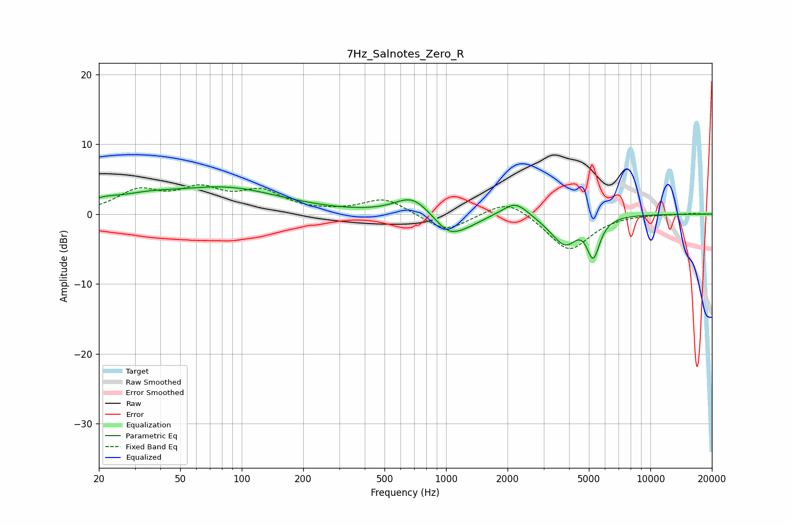

# 7Hz_Salnotes_Zero_R
See [usage instructions](https://github.com/jaakkopasanen/AutoEq#usage) for more options and info.

### Parametric EQs
Apply preamp of -4.0 dB when using parametric equalizer.

|   # | Type    |   Fc (Hz) |    Q |   Gain (dB) |
|-----|---------|-----------|------|-------------|
|   1 | Peaking |        21 | 1.75 |         1   |
|   2 | Peaking |        34 | 0.97 |         1.4 |
|   3 | Peaking |        84 | 0.52 |         3.6 |
|   4 | Peaking |       685 | 1.67 |         2.7 |
|   5 | Peaking |      1029 | 1.91 |        -2.7 |
|   6 | Peaking |      1258 | 1.69 |        -1   |
|   7 | Peaking |      2185 | 2.23 |         2.3 |
|   8 | Peaking |      3894 | 1.88 |        -5.8 |
|   9 | Peaking |      4576 | 1.73 |         2.7 |
|  10 | Peaking |      5244 | 4.08 |        -6.2 |

### Fixed Band EQs
When using fixed band (also called graphic) equalizer, apply preamp of **-4.3 dB** (if available) and set gains manually with these parameters.

|   # | Type    |   Fc (Hz) |    Q |   Gain (dB) |
|-----|---------|-----------|------|-------------|
|   1 | Peaking |        31 | 1.41 |         3   |
|   2 | Peaking |        62 | 1.41 |         3.1 |
|   3 | Peaking |       125 | 1.41 |         2.9 |
|   4 | Peaking |       250 | 1.41 |         0.1 |
|   5 | Peaking |       500 | 1.41 |         2.3 |
|   6 | Peaking |      1000 | 1.41 |        -2.6 |
|   7 | Peaking |      2000 | 1.41 |         2.4 |
|   8 | Peaking |      4000 | 1.41 |        -5.3 |
|   9 | Peaking |      8000 | 1.41 |         0.1 |
|  10 | Peaking |     16000 | 1.41 |         0.1 |

### Graphs

