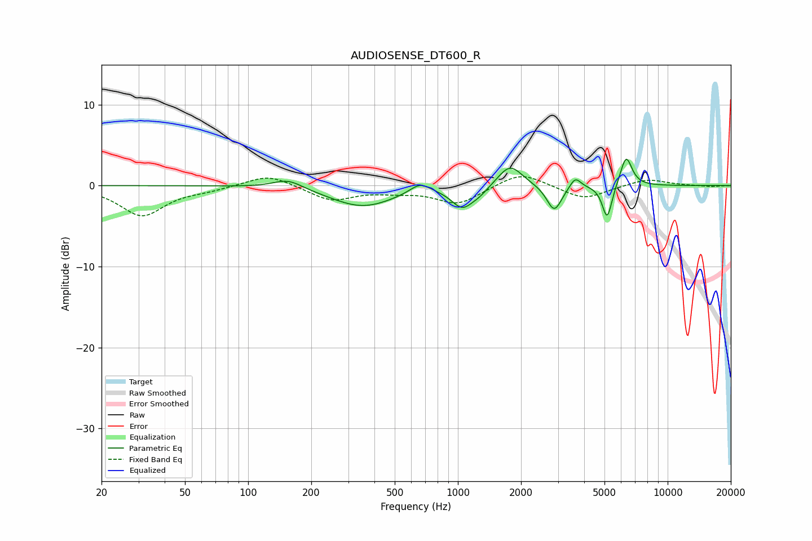

# AUDIOSENSE_DT600_R
See [usage instructions](https://github.com/jaakkopasanen/AutoEq#usage) for more options and info.

### Parametric EQs
Apply preamp of -3.4 dB when using parametric equalizer.

|   # | Type    |   Fc (Hz) |    Q |   Gain (dB) |
|-----|---------|-----------|------|-------------|
|   1 | Peaking |       155 | 2.01 |         1.2 |
|   2 | Peaking |       351 | 0.93 |        -2.6 |
|   3 | Peaking |       660 | 2.91 |         1.3 |
|   4 | Peaking |      1049 | 2.76 |        -2.5 |
|   5 | Peaking |      1265 | 3.02 |        -0.8 |
|   6 | Peaking |      1772 | 2.42 |         2.8 |
|   7 | Peaking |      2880 | 3.97 |        -3.3 |
|   8 | Peaking |      3626 | 5.45 |         1.4 |
|   9 | Peaking |      5149 | 6    |        -4.3 |
|  10 | Peaking |      6340 | 4.95 |         3.8 |

### Fixed Band EQs
When using fixed band (also called graphic) equalizer, apply preamp of **-1.2 dB** (if available) and set gains manually with these parameters.

|   # | Type    |   Fc (Hz) |    Q |   Gain (dB) |
|-----|---------|-----------|------|-------------|
|   1 | Peaking |        31 | 1.41 |        -3.7 |
|   2 | Peaking |        62 | 1.41 |        -0.4 |
|   3 | Peaking |       125 | 1.41 |         1.5 |
|   4 | Peaking |       250 | 1.41 |        -1.8 |
|   5 | Peaking |       500 | 1.41 |        -0.6 |
|   6 | Peaking |      1000 | 1.41 |        -2.2 |
|   7 | Peaking |      2000 | 1.41 |         1.8 |
|   8 | Peaking |      4000 | 1.41 |        -1.7 |
|   9 | Peaking |      8000 | 1.41 |         0.9 |
|  10 | Peaking |     16000 | 1.41 |        -0.1 |

### Graphs

