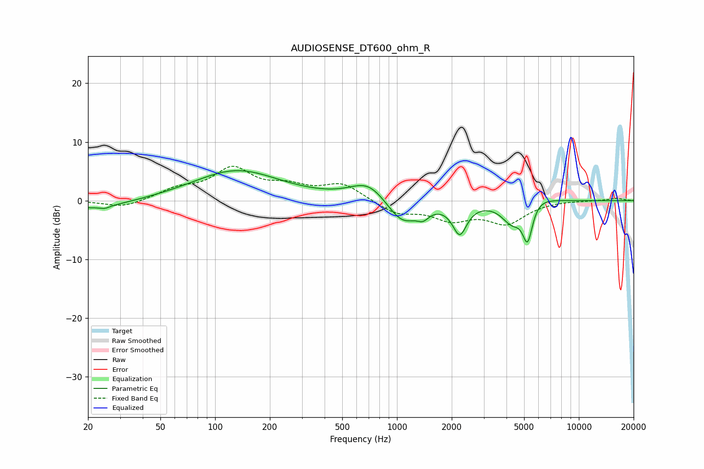

# AUDIOSENSE_DT600_ohm_R
See [usage instructions](https://github.com/jaakkopasanen/AutoEq#usage) for more options and info.

### Parametric EQs
Apply preamp of -5.2 dB when using parametric equalizer.

|   # | Type    |   Fc (Hz) |    Q |   Gain (dB) |
|-----|---------|-----------|------|-------------|
|   1 | Peaking |        21 | 0.65 |        -1.5 |
|   2 | Peaking |        25 | 5.18 |        -0.4 |
|   3 | Peaking |       131 | 0.59 |         5.2 |
|   4 | Peaking |       698 | 1.41 |         3.3 |
|   5 | Peaking |      1068 | 1.63 |        -4.3 |
|   6 | Peaking |      1392 | 4.41 |        -1.4 |
|   7 | Peaking |      2214 | 3.62 |        -5.2 |
|   8 | Peaking |      4291 | 2.41 |        -3.8 |
|   9 | Peaking |      5227 | 4.72 |        -7.2 |
|  10 | Peaking |      5428 | 1.67 |         2.2 |

### Fixed Band EQs
When using fixed band (also called graphic) equalizer, apply preamp of **-5.9 dB** (if available) and set gains manually with these parameters.

|   # | Type    |   Fc (Hz) |    Q |   Gain (dB) |
|-----|---------|-----------|------|-------------|
|   1 | Peaking |        31 | 1.41 |        -1.3 |
|   2 | Peaking |        62 | 1.41 |         1.7 |
|   3 | Peaking |       125 | 1.41 |         5.1 |
|   4 | Peaking |       250 | 1.41 |         1.9 |
|   5 | Peaking |       500 | 1.41 |         2.8 |
|   6 | Peaking |      1000 | 1.41 |        -2.1 |
|   7 | Peaking |      2000 | 1.41 |        -2.9 |
|   8 | Peaking |      4000 | 1.41 |        -3.6 |
|   9 | Peaking |      8000 | 1.41 |         0.1 |
|  10 | Peaking |     16000 | 1.41 |         0.4 |

### Graphs

