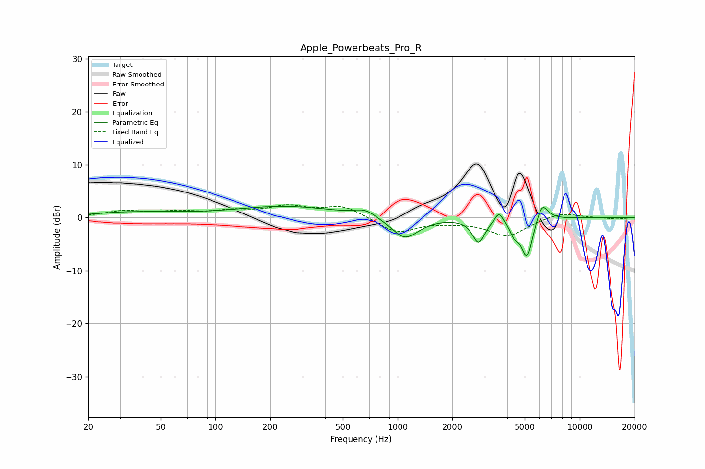

# Apple_Powerbeats_Pro_R
See [usage instructions](https://github.com/jaakkopasanen/AutoEq#usage) for more options and info.

### Parametric EQs
Apply preamp of -2.2 dB when using parametric equalizer.

|   # | Type    |   Fc (Hz) |    Q |   Gain (dB) |
|-----|---------|-----------|------|-------------|
|   1 | Peaking |        31 | 0.8  |         0.8 |
|   2 | Peaking |        57 | 0.98 |         0.4 |
|   3 | Peaking |       242 | 0.5  |         2.1 |
|   4 | Peaking |       663 | 2.47 |         1.3 |
|   5 | Peaking |      1098 | 1.92 |        -4.1 |
|   6 | Peaking |      2785 | 4.39 |        -4.5 |
|   7 | Peaking |      3614 | 6    |         2.2 |
|   8 | Peaking |      4379 | 5.95 |        -2.2 |
|   9 | Peaking |      5139 | 4.36 |        -7.5 |
|  10 | Peaking |      6220 | 4.21 |         3.7 |

### Fixed Band EQs
When using fixed band (also called graphic) equalizer, apply preamp of **-2.5 dB** (if available) and set gains manually with these parameters.

|   # | Type    |   Fc (Hz) |    Q |   Gain (dB) |
|-----|---------|-----------|------|-------------|
|   1 | Peaking |        31 | 1.41 |         1.1 |
|   2 | Peaking |        62 | 1.41 |         0.9 |
|   3 | Peaking |       125 | 1.41 |         1.1 |
|   4 | Peaking |       250 | 1.41 |         1.9 |
|   5 | Peaking |       500 | 1.41 |         2.2 |
|   6 | Peaking |      1000 | 1.41 |        -2.9 |
|   7 | Peaking |      2000 | 1.41 |        -0.5 |
|   8 | Peaking |      4000 | 1.41 |        -3.4 |
|   9 | Peaking |      8000 | 1.41 |         1.1 |
|  10 | Peaking |     16000 | 1.41 |        -0.3 |

### Graphs

