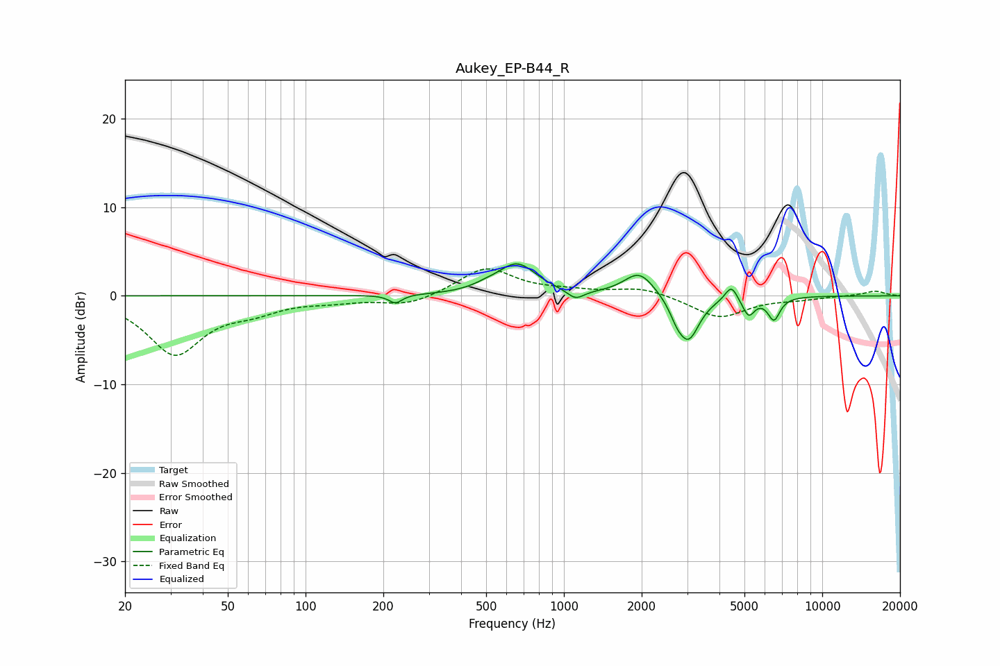

# Aukey_EP-B44_R
See [usage instructions](https://github.com/jaakkopasanen/AutoEq#usage) for more options and info.

### Parametric EQs
Apply preamp of -3.7 dB when using parametric equalizer.

|   # | Type    |   Fc (Hz) |    Q |   Gain (dB) |
|-----|---------|-----------|------|-------------|
|   1 | Peaking |       223 | 5.64 |        -0.9 |
|   2 | Peaking |       499 | 2.65 |         0.4 |
|   3 | Peaking |       659 | 1.89 |         3.5 |
|   4 | Peaking |      1110 | 4.4  |        -1.1 |
|   5 | Peaking |      1960 | 2.38 |         2.8 |
|   6 | Peaking |      2734 | 5.31 |        -1.2 |
|   7 | Peaking |      3036 | 3.31 |        -4.9 |
|   8 | Peaking |      4445 | 6    |         1.8 |
|   9 | Peaking |      5188 | 6    |        -2.1 |
|  10 | Peaking |      6502 | 5.86 |        -2.5 |

### Fixed Band EQs
When using fixed band (also called graphic) equalizer, apply preamp of **-3.1 dB** (if available) and set gains manually with these parameters.

|   # | Type    |   Fc (Hz) |    Q |   Gain (dB) |
|-----|---------|-----------|------|-------------|
|   1 | Peaking |        31 | 1.41 |        -6.5 |
|   2 | Peaking |        62 | 1.41 |        -1.3 |
|   3 | Peaking |       125 | 1.41 |        -0.5 |
|   4 | Peaking |       250 | 1.41 |        -1.1 |
|   5 | Peaking |       500 | 1.41 |         3.2 |
|   6 | Peaking |      1000 | 1.41 |         0.4 |
|   7 | Peaking |      2000 | 1.41 |         1   |
|   8 | Peaking |      4000 | 1.41 |        -2.5 |
|   9 | Peaking |      8000 | 1.41 |        -0.3 |
|  10 | Peaking |     16000 | 1.41 |         0.6 |

### Graphs

