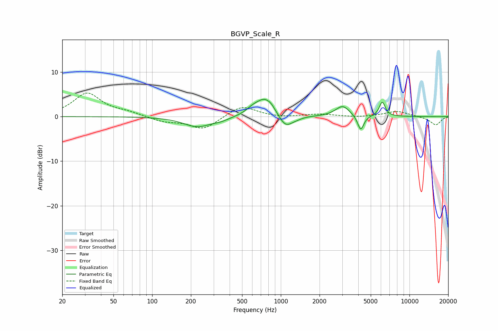

# BGVP_Scale_R
See [usage instructions](https://github.com/jaakkopasanen/AutoEq#usage) for more options and info.

### Parametric EQs
Apply preamp of -4.0 dB when using parametric equalizer.

|   # | Type    |   Fc (Hz) |    Q |   Gain (dB) |
|-----|---------|-----------|------|-------------|
|   1 | Peaking |       224 | 1.33 |        -2.3 |
|   2 | Peaking |       341 | 2.18 |        -0.6 |
|   3 | Peaking |       601 | 2.89 |         0.9 |
|   4 | Peaking |       751 | 1.99 |         4   |
|   5 | Peaking |       845 | 5.36 |         0.5 |
|   6 | Peaking |      1088 | 2.71 |        -2.8 |
|   7 | Peaking |      1316 | 3.13 |        -0.4 |
|   8 | Peaking |      3022 | 2.63 |         2.4 |
|   9 | Peaking |      4179 | 5.79 |        -3.4 |
|  10 | Peaking |      6145 | 5.93 |         3.2 |

### Fixed Band EQs
When using fixed band (also called graphic) equalizer, apply preamp of **-5.4 dB** (if available) and set gains manually with these parameters.

|   # | Type    |   Fc (Hz) |    Q |   Gain (dB) |
|-----|---------|-----------|------|-------------|
|   1 | Peaking |        31 | 1.41 |         5.2 |
|   2 | Peaking |        62 | 1.41 |         0.8 |
|   3 | Peaking |       125 | 1.41 |        -1.1 |
|   4 | Peaking |       250 | 1.41 |        -2.9 |
|   5 | Peaking |       500 | 1.41 |         2.6 |
|   6 | Peaking |      1000 | 1.41 |        -0.2 |
|   7 | Peaking |      2000 | 1.41 |         0.6 |
|   8 | Peaking |      4000 | 1.41 |        -0.2 |
|   9 | Peaking |      8000 | 1.41 |         1.2 |
|  10 | Peaking |     16000 | 1.41 |        -1.9 |

### Graphs

