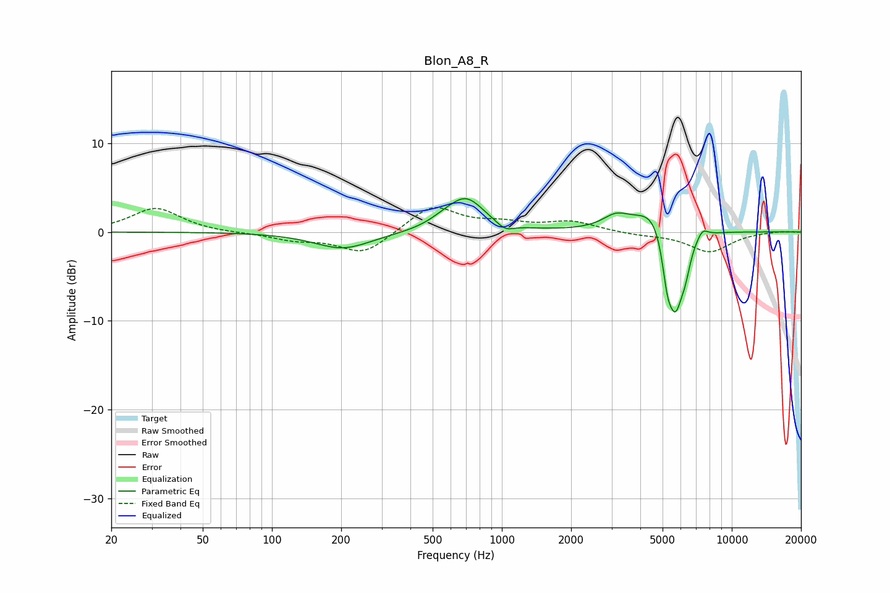

# Blon_A8_R
See [usage instructions](https://github.com/jaakkopasanen/AutoEq#usage) for more options and info.

### Parametric EQs
Apply preamp of -3.8 dB when using parametric equalizer.

|   # | Type    |   Fc (Hz) |    Q |   Gain (dB) |
|-----|---------|-----------|------|-------------|
|   1 | Peaking |       204 | 1.14 |        -1.9 |
|   2 | Peaking |       557 | 2.13 |         0.6 |
|   3 | Peaking |       699 | 1.77 |         3.6 |
|   4 | Peaking |      1033 | 3.86 |        -0.8 |
|   5 | Peaking |      3135 | 2.42 |         1.4 |
|   6 | Peaking |      4669 | 1.71 |         3.4 |
|   7 | Peaking |      5242 | 6    |        -4.3 |
|   8 | Peaking |      5696 | 3.89 |        -8.6 |
|   9 | Peaking |      6277 | 6    |        -2.2 |
|  10 | Peaking |      7451 | 5.56 |         1   |

### Fixed Band EQs
When using fixed band (also called graphic) equalizer, apply preamp of **-2.8 dB** (if available) and set gains manually with these parameters.

|   # | Type    |   Fc (Hz) |    Q |   Gain (dB) |
|-----|---------|-----------|------|-------------|
|   1 | Peaking |        31 | 1.41 |         2.7 |
|   2 | Peaking |        62 | 1.41 |        -0.1 |
|   3 | Peaking |       125 | 1.41 |        -0.8 |
|   4 | Peaking |       250 | 1.41 |        -2.5 |
|   5 | Peaking |       500 | 1.41 |         3   |
|   6 | Peaking |      1000 | 1.41 |         0.8 |
|   7 | Peaking |      2000 | 1.41 |         1.1 |
|   8 | Peaking |      4000 | 1.41 |        -0.3 |
|   9 | Peaking |      8000 | 1.41 |        -2.2 |
|  10 | Peaking |     16000 | 1.41 |         0.1 |

### Graphs

