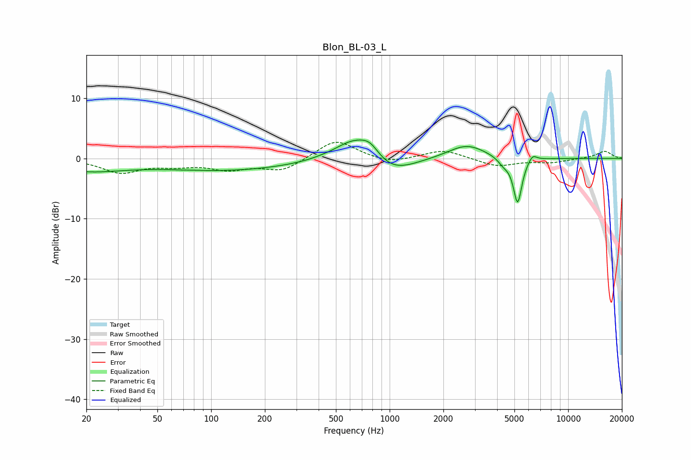

# Blon_BL-03_L
See [usage instructions](https://github.com/jaakkopasanen/AutoEq#usage) for more options and info.

### Parametric EQs
Apply preamp of -3.2 dB when using parametric equalizer.

|   # | Type    |   Fc (Hz) |    Q |   Gain (dB) |
|-----|---------|-----------|------|-------------|
|   1 | Peaking |        20 | 0.65 |        -1.9 |
|   2 | Peaking |       125 | 0.36 |        -1.9 |
|   3 | Peaking |       411 | 3.08 |         0   |
|   4 | Peaking |       643 | 1.21 |         4.1 |
|   5 | Peaking |       778 | 2.76 |         1.7 |
|   6 | Peaking |      1006 | 1.09 |        -3.1 |
|   7 | Peaking |      2703 | 1.34 |         2.4 |
|   8 | Peaking |      4344 | 4.42 |        -1   |
|   9 | Peaking |      5209 | 5.75 |        -7.6 |
|  10 | Peaking |      6313 | 5.77 |         1.2 |

### Fixed Band EQs
When using fixed band (also called graphic) equalizer, apply preamp of **-2.8 dB** (if available) and set gains manually with these parameters.

|   # | Type    |   Fc (Hz) |    Q |   Gain (dB) |
|-----|---------|-----------|------|-------------|
|   1 | Peaking |        31 | 1.41 |        -2.3 |
|   2 | Peaking |        62 | 1.41 |        -0.9 |
|   3 | Peaking |       125 | 1.41 |        -1.6 |
|   4 | Peaking |       250 | 1.41 |        -2   |
|   5 | Peaking |       500 | 1.41 |         3.2 |
|   6 | Peaking |      1000 | 1.41 |        -0.9 |
|   7 | Peaking |      2000 | 1.41 |         1.5 |
|   8 | Peaking |      4000 | 1.41 |        -1.3 |
|   9 | Peaking |      8000 | 1.41 |        -0.6 |
|  10 | Peaking |     16000 | 1.41 |         1.2 |

### Graphs

