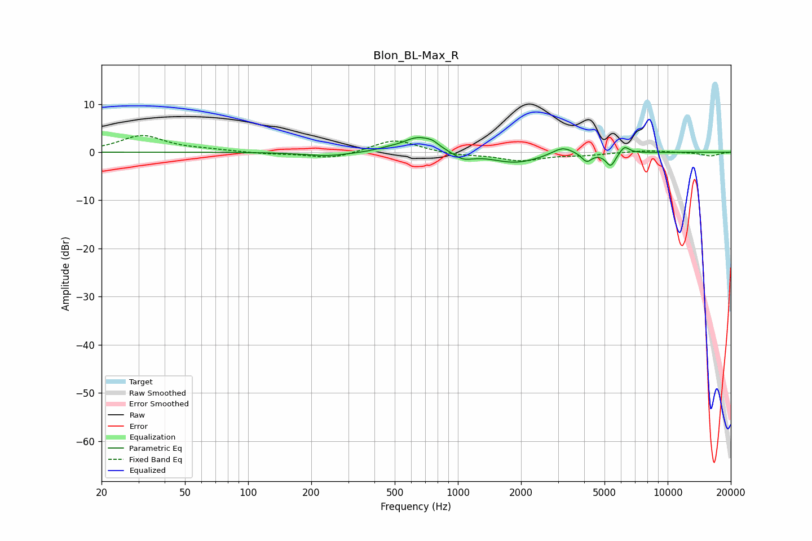

# Blon_BL-Max_R
See [usage instructions](https://github.com/jaakkopasanen/AutoEq#usage) for more options and info.

### Parametric EQs
Apply preamp of -3.1 dB when using parametric equalizer.

|   # | Type    |   Fc (Hz) |    Q |   Gain (dB) |
|-----|---------|-----------|------|-------------|
|   1 | Peaking |       240 | 1.3  |        -0.8 |
|   2 | Peaking |       455 | 3.07 |         0.3 |
|   3 | Peaking |       648 | 1.83 |         3.2 |
|   4 | Peaking |       757 | 5.1  |         0.6 |
|   5 | Peaking |      1059 | 3    |        -1.5 |
|   6 | Peaking |      1884 | 1.21 |        -2.2 |
|   7 | Peaking |      3156 | 2.87 |         1.7 |
|   8 | Peaking |      4110 | 6    |        -1.8 |
|   9 | Peaking |      5355 | 6    |        -2.8 |
|  10 | Peaking |      6224 | 5.99 |         1.6 |

### Fixed Band EQs
When using fixed band (also called graphic) equalizer, apply preamp of **-3.6 dB** (if available) and set gains manually with these parameters.

|   # | Type    |   Fc (Hz) |    Q |   Gain (dB) |
|-----|---------|-----------|------|-------------|
|   1 | Peaking |        31 | 1.41 |         3.4 |
|   2 | Peaking |        62 | 1.41 |         0.4 |
|   3 | Peaking |       125 | 1.41 |        -0.3 |
|   4 | Peaking |       250 | 1.41 |        -1.4 |
|   5 | Peaking |       500 | 1.41 |         2.7 |
|   6 | Peaking |      1000 | 1.41 |        -0.6 |
|   7 | Peaking |      2000 | 1.41 |        -1.7 |
|   8 | Peaking |      4000 | 1.41 |        -0.5 |
|   9 | Peaking |      8000 | 1.41 |         0.4 |
|  10 | Peaking |     16000 | 1.41 |        -0.8 |

### Graphs

