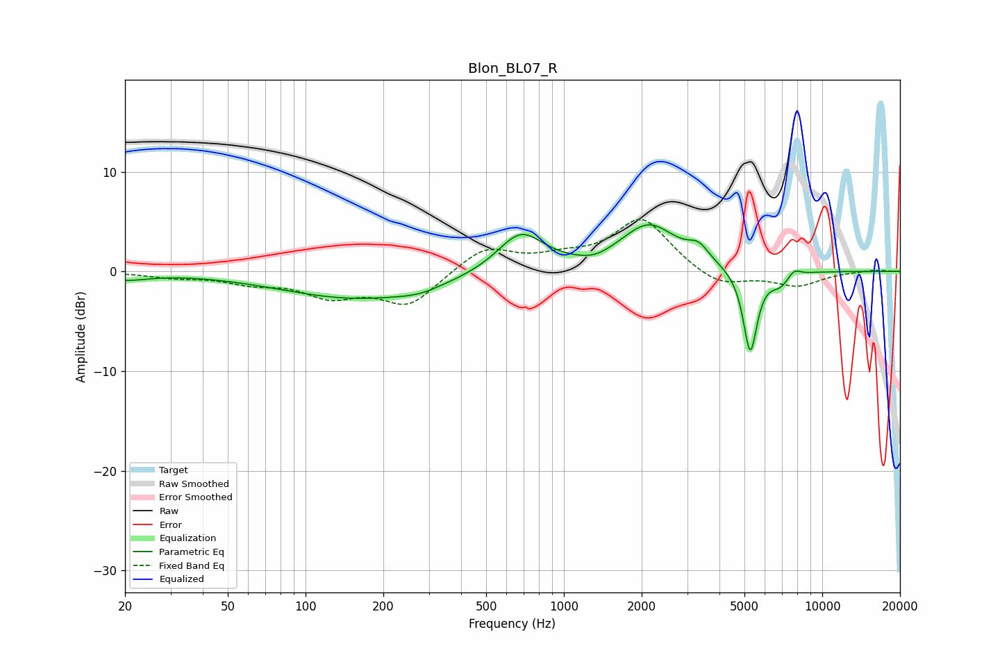

# Blon_BL07_R
See [usage instructions](https://github.com/jaakkopasanen/AutoEq#usage) for more options and info.

### Parametric EQs
Apply preamp of -4.8 dB when using parametric equalizer.

|   # | Type    |   Fc (Hz) |    Q |   Gain (dB) |
|-----|---------|-----------|------|-------------|
|   1 | Peaking |        20 | 1.61 |        -0.7 |
|   2 | Peaking |       160 | 0.47 |        -2.7 |
|   3 | Peaking |       274 | 1.71 |        -0.5 |
|   4 | Peaking |       680 | 1.55 |         4   |
|   5 | Peaking |      1314 | 2.39 |        -0.5 |
|   6 | Peaking |      2133 | 1.29 |         4.6 |
|   7 | Peaking |      3320 | 3.51 |         1.4 |
|   8 | Peaking |      5264 | 5.07 |        -8.4 |
|   9 | Peaking |      6871 | 3.57 |        -1.2 |
|  10 | Peaking |      7774 | 5.64 |         0.7 |

### Fixed Band EQs
When using fixed band (also called graphic) equalizer, apply preamp of **-5.3 dB** (if available) and set gains manually with these parameters.

|   # | Type    |   Fc (Hz) |    Q |   Gain (dB) |
|-----|---------|-----------|------|-------------|
|   1 | Peaking |        31 | 1.41 |        -0.5 |
|   2 | Peaking |        62 | 1.41 |        -1   |
|   3 | Peaking |       125 | 1.41 |        -2.2 |
|   4 | Peaking |       250 | 1.41 |        -3.3 |
|   5 | Peaking |       500 | 1.41 |         2.5 |
|   6 | Peaking |      1000 | 1.41 |         1.1 |
|   7 | Peaking |      2000 | 1.41 |         5.3 |
|   8 | Peaking |      4000 | 1.41 |        -1.7 |
|   9 | Peaking |      8000 | 1.41 |        -1.4 |
|  10 | Peaking |     16000 | 1.41 |         0.2 |

### Graphs

