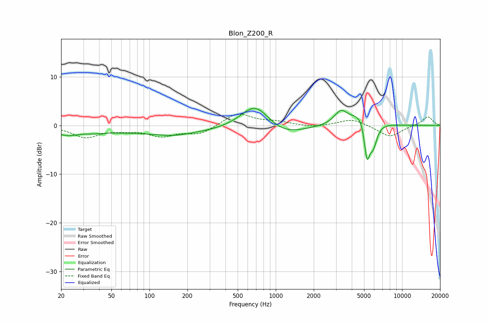

# Blon_Z200_R
See [usage instructions](https://github.com/jaakkopasanen/AutoEq#usage) for more options and info.

### Parametric EQs
Apply preamp of -3.6 dB when using parametric equalizer.

|   # | Type    |   Fc (Hz) |    Q |   Gain (dB) |
|-----|---------|-----------|------|-------------|
|   1 | Peaking |        22 | 1.46 |        -1.4 |
|   2 | Peaking |        37 | 2.25 |        -0.3 |
|   3 | Peaking |       130 | 0.2  |        -1.5 |
|   4 | Peaking |       154 | 1.1  |        -0.7 |
|   5 | Peaking |       692 | 1.18 |         5.7 |
|   6 | Peaking |      1095 | 0.85 |        -2.5 |
|   7 | Peaking |      3276 | 2.76 |         2.7 |
|   8 | Peaking |      4938 | 1.81 |         3.6 |
|   9 | Peaking |      5272 | 5.95 |        -8.2 |
|  10 | Peaking |      5908 | 4.32 |        -4.9 |

### Fixed Band EQs
When using fixed band (also called graphic) equalizer, apply preamp of **-2.5 dB** (if available) and set gains manually with these parameters.

|   # | Type    |   Fc (Hz) |    Q |   Gain (dB) |
|-----|---------|-----------|------|-------------|
|   1 | Peaking |        31 | 1.41 |        -2.4 |
|   2 | Peaking |        62 | 1.41 |        -0.6 |
|   3 | Peaking |       125 | 1.41 |        -2   |
|   4 | Peaking |       250 | 1.41 |        -1.7 |
|   5 | Peaking |       500 | 1.41 |         2.6 |
|   6 | Peaking |      1000 | 1.41 |         0.7 |
|   7 | Peaking |      2000 | 1.41 |        -0.4 |
|   8 | Peaking |      4000 | 1.41 |         1.4 |
|   9 | Peaking |      8000 | 1.41 |        -2.4 |
|  10 | Peaking |     16000 | 1.41 |         1.9 |

### Graphs

