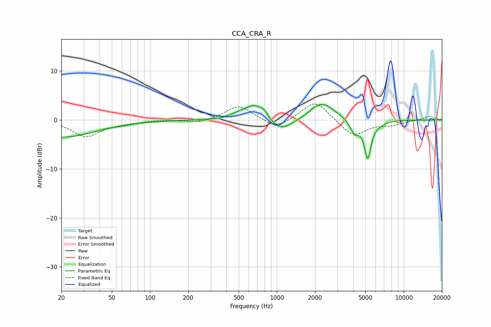

# CCA_CRA_R
See [usage instructions](https://github.com/jaakkopasanen/AutoEq#usage) for more options and info.

### Parametric EQs
Apply preamp of -3.2 dB when using parametric equalizer.

|   # | Type    |   Fc (Hz) |    Q |   Gain (dB) |
|-----|---------|-----------|------|-------------|
|   1 | Peaking |        20 | 0.53 |        -3.5 |
|   2 | Peaking |       495 | 2.41 |         0.8 |
|   3 | Peaking |       663 | 2.03 |         3   |
|   4 | Peaking |       792 | 4.8  |         1.1 |
|   5 | Peaking |      1083 | 1.59 |        -2.5 |
|   6 | Peaking |      2000 | 2.33 |         0.6 |
|   7 | Peaking |      2342 | 1.53 |         3.1 |
|   8 | Peaking |      4099 | 4.14 |        -2.6 |
|   9 | Peaking |      5205 | 5.08 |        -7.5 |
|  10 | Peaking |      6424 | 2.75 |        -0.5 |

### Fixed Band EQs
When using fixed band (also called graphic) equalizer, apply preamp of **-3.3 dB** (if available) and set gains manually with these parameters.

|   # | Type    |   Fc (Hz) |    Q |   Gain (dB) |
|-----|---------|-----------|------|-------------|
|   1 | Peaking |        31 | 1.41 |        -3.3 |
|   2 | Peaking |        62 | 1.41 |        -0.6 |
|   3 | Peaking |       125 | 1.41 |         0.1 |
|   4 | Peaking |       250 | 1.41 |        -0.7 |
|   5 | Peaking |       500 | 1.41 |         3   |
|   6 | Peaking |      1000 | 1.41 |        -2   |
|   7 | Peaking |      2000 | 1.41 |         4.1 |
|   8 | Peaking |      4000 | 1.41 |        -3.4 |
|   9 | Peaking |      8000 | 1.41 |        -0.9 |
|  10 | Peaking |     16000 | 1.41 |         0.8 |

### Graphs

