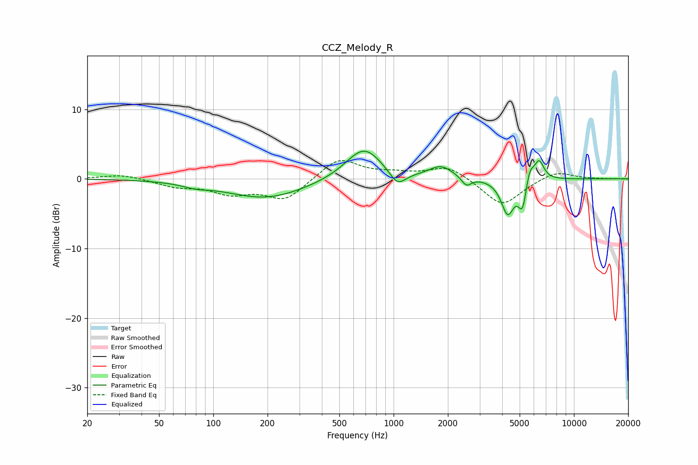

# CCZ_Melody_R
See [usage instructions](https://github.com/jaakkopasanen/AutoEq#usage) for more options and info.

### Parametric EQs
Apply preamp of -4.1 dB when using parametric equalizer.

|   # | Type    |   Fc (Hz) |    Q |   Gain (dB) |
|-----|---------|-----------|------|-------------|
|   1 | Peaking |        80 | 2    |        -0.5 |
|   2 | Peaking |       196 | 0.65 |        -2.8 |
|   3 | Peaking |       684 | 1.4  |         4.7 |
|   4 | Peaking |      1051 | 3.08 |        -2.2 |
|   5 | Peaking |      1832 | 2.17 |         1.7 |
|   6 | Peaking |      2533 | 5.34 |        -1.3 |
|   7 | Peaking |      4292 | 3.93 |        -4.9 |
|   8 | Peaking |      5193 | 6    |        -4.2 |
|   9 | Peaking |      5672 | 6    |         2.4 |
|  10 | Peaking |      6413 | 5.13 |         2.8 |

### Fixed Band EQs
When using fixed band (also called graphic) equalizer, apply preamp of **-2.7 dB** (if available) and set gains manually with these parameters.

|   # | Type    |   Fc (Hz) |    Q |   Gain (dB) |
|-----|---------|-----------|------|-------------|
|   1 | Peaking |        31 | 1.41 |         0.7 |
|   2 | Peaking |        62 | 1.41 |        -1   |
|   3 | Peaking |       125 | 1.41 |        -1.9 |
|   4 | Peaking |       250 | 1.41 |        -3   |
|   5 | Peaking |       500 | 1.41 |         3.1 |
|   6 | Peaking |      1000 | 1.41 |         0.6 |
|   7 | Peaking |      2000 | 1.41 |         1.9 |
|   8 | Peaking |      4000 | 1.41 |        -3.9 |
|   9 | Peaking |      8000 | 1.41 |         1.2 |
|  10 | Peaking |     16000 | 1.41 |        -0   |

### Graphs

