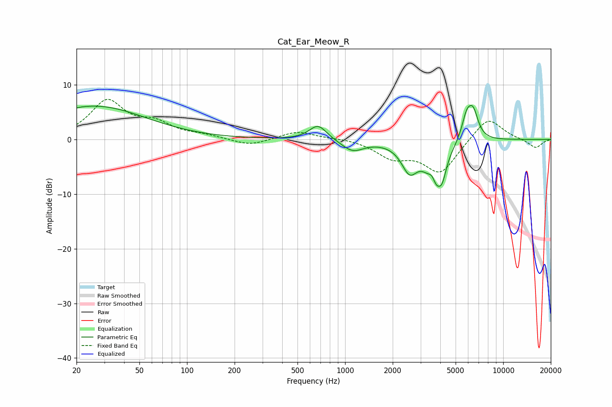

# Cat_Ear_Meow_R
See [usage instructions](https://github.com/jaakkopasanen/AutoEq#usage) for more options and info.

### Parametric EQs
Apply preamp of -6.3 dB when using parametric equalizer.

|   # | Type    |   Fc (Hz) |    Q |   Gain (dB) |
|-----|---------|-----------|------|-------------|
|   1 | Peaking |        20 | 1.62 |         0.4 |
|   2 | Peaking |        27 | 0.46 |         5.9 |
|   3 | Peaking |       675 | 2.56 |         2.8 |
|   4 | Peaking |      1116 | 2.03 |        -2.1 |
|   5 | Peaking |      2554 | 2.78 |        -4.9 |
|   6 | Peaking |      3558 | 5.92 |         2.9 |
|   7 | Peaking |      3690 | 2.7  |        -8.7 |
|   8 | Peaking |      4119 | 6    |        -2.5 |
|   9 | Peaking |      5884 | 4.26 |         4.4 |
|  10 | Peaking |      6471 | 4.31 |         4.5 |

### Fixed Band EQs
When using fixed band (also called graphic) equalizer, apply preamp of **-7.4 dB** (if available) and set gains manually with these parameters.

|   # | Type    |   Fc (Hz) |    Q |   Gain (dB) |
|-----|---------|-----------|------|-------------|
|   1 | Peaking |        31 | 1.41 |         6.9 |
|   2 | Peaking |        62 | 1.41 |         2.5 |
|   3 | Peaking |       125 | 1.41 |         0.6 |
|   4 | Peaking |       250 | 1.41 |        -1.2 |
|   5 | Peaking |       500 | 1.41 |         1.5 |
|   6 | Peaking |      1000 | 1.41 |         0.3 |
|   7 | Peaking |      2000 | 1.41 |        -3   |
|   8 | Peaking |      4000 | 1.41 |        -6   |
|   9 | Peaking |      8000 | 1.41 |         4.3 |
|  10 | Peaking |     16000 | 1.41 |        -1.6 |

### Graphs

