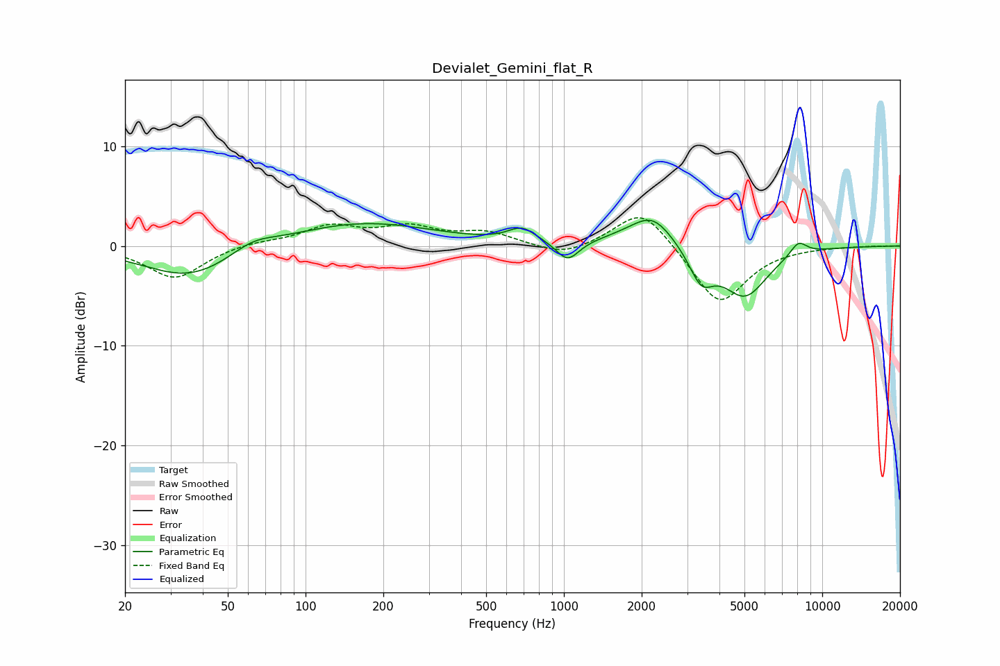

# Devialet_Gemini_flat_R
See [usage instructions](https://github.com/jaakkopasanen/AutoEq#usage) for more options and info.

### Parametric EQs
Apply preamp of -2.7 dB when using parametric equalizer.

|   # | Type    |   Fc (Hz) |    Q |   Gain (dB) |
|-----|---------|-----------|------|-------------|
|   1 | Peaking |        36 | 0.79 |        -3.3 |
|   2 | Peaking |        62 | 1.65 |         1.1 |
|   3 | Peaking |       164 | 0.51 |         2.4 |
|   4 | Peaking |       689 | 2.62 |         1.4 |
|   5 | Peaking |      1034 | 3.23 |        -2   |
|   6 | Peaking |      1755 | 1.21 |         0.6 |
|   7 | Peaking |      2210 | 1.75 |         2.9 |
|   8 | Peaking |      3404 | 3    |        -3.1 |
|   9 | Peaking |      5016 | 1.56 |        -5   |
|  10 | Peaking |      8086 | 4.03 |         1.4 |

### Fixed Band EQs
When using fixed band (also called graphic) equalizer, apply preamp of **-2.9 dB** (if available) and set gains manually with these parameters.

|   # | Type    |   Fc (Hz) |    Q |   Gain (dB) |
|-----|---------|-----------|------|-------------|
|   1 | Peaking |        31 | 1.41 |        -3.3 |
|   2 | Peaking |        62 | 1.41 |         0.4 |
|   3 | Peaking |       125 | 1.41 |         1.9 |
|   4 | Peaking |       250 | 1.41 |         1.7 |
|   5 | Peaking |       500 | 1.41 |         1.3 |
|   6 | Peaking |      1000 | 1.41 |        -1.2 |
|   7 | Peaking |      2000 | 1.41 |         4   |
|   8 | Peaking |      4000 | 1.41 |        -6   |
|   9 | Peaking |      8000 | 1.41 |        -0   |
|  10 | Peaking |     16000 | 1.41 |         0   |

### Graphs

