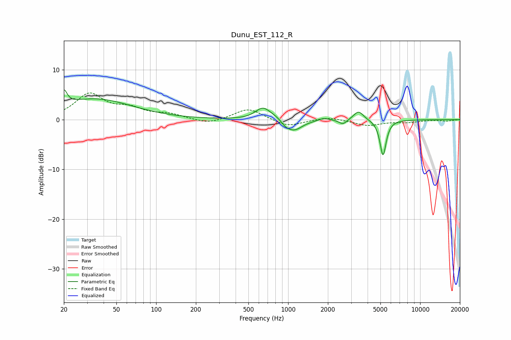

# Dunu_EST_112_R
See [usage instructions](https://github.com/jaakkopasanen/AutoEq#usage) for more options and info.

### Parametric EQs
Apply preamp of -6.1 dB when using parametric equalizer.

|   # | Type    |   Fc (Hz) |    Q |   Gain (dB) |
|-----|---------|-----------|------|-------------|
|   1 | Peaking |        20 | 6    |         2.9 |
|   2 | Peaking |        34 | 0.51 |         4.1 |
|   3 | Peaking |       640 | 2.58 |         2.2 |
|   4 | Peaking |       795 | 2.07 |         0.7 |
|   5 | Peaking |       951 | 4.55 |        -0.6 |
|   6 | Peaking |      1099 | 2.16 |        -2.4 |
|   7 | Peaking |      1862 | 3.68 |         0.5 |
|   8 | Peaking |      2601 | 4.73 |        -1   |
|   9 | Peaking |      3414 | 3.81 |         1.9 |
|  10 | Peaking |      5233 | 6    |        -7.2 |

### Fixed Band EQs
When using fixed band (also called graphic) equalizer, apply preamp of **-5.5 dB** (if available) and set gains manually with these parameters.

|   # | Type    |   Fc (Hz) |    Q |   Gain (dB) |
|-----|---------|-----------|------|-------------|
|   1 | Peaking |        31 | 1.41 |         5   |
|   2 | Peaking |        62 | 1.41 |         1.9 |
|   3 | Peaking |       125 | 1.41 |         0.9 |
|   4 | Peaking |       250 | 1.41 |        -1   |
|   5 | Peaking |       500 | 1.41 |         2.3 |
|   6 | Peaking |      1000 | 1.41 |        -1.5 |
|   7 | Peaking |      2000 | 1.41 |         0.6 |
|   8 | Peaking |      4000 | 1.41 |        -1.2 |
|   9 | Peaking |      8000 | 1.41 |        -0.5 |
|  10 | Peaking |     16000 | 1.41 |        -0.3 |

### Graphs

