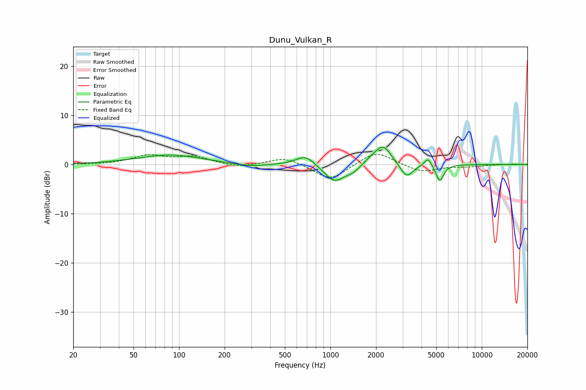

# Dunu_Vulkan_R
See [usage instructions](https://github.com/jaakkopasanen/AutoEq#usage) for more options and info.

### Parametric EQs
Apply preamp of -3.6 dB when using parametric equalizer.

|   # | Type    |   Fc (Hz) |    Q |   Gain (dB) |
|-----|---------|-----------|------|-------------|
|   1 | Peaking |        87 | 0.68 |         1.9 |
|   2 | Peaking |       293 | 1.34 |        -0.6 |
|   3 | Peaking |       683 | 2.27 |         2.1 |
|   4 | Peaking |      1063 | 2.09 |        -3.6 |
|   5 | Peaking |      1421 | 2.87 |        -1.1 |
|   6 | Peaking |      1848 | 2.28 |         0.9 |
|   7 | Peaking |      2233 | 2.64 |         3.8 |
|   8 | Peaking |      3189 | 3.35 |        -2.9 |
|   9 | Peaking |      4409 | 6    |         1.8 |
|  10 | Peaking |      5274 | 5.59 |        -3.4 |

### Fixed Band EQs
When using fixed band (also called graphic) equalizer, apply preamp of **-2.2 dB** (if available) and set gains manually with these parameters.

|   # | Type    |   Fc (Hz) |    Q |   Gain (dB) |
|-----|---------|-----------|------|-------------|
|   1 | Peaking |        31 | 1.41 |        -0.1 |
|   2 | Peaking |        62 | 1.41 |         1.7 |
|   3 | Peaking |       125 | 1.41 |         1.5 |
|   4 | Peaking |       250 | 1.41 |        -0.7 |
|   5 | Peaking |       500 | 1.41 |         1.5 |
|   6 | Peaking |      1000 | 1.41 |        -3.3 |
|   7 | Peaking |      2000 | 1.41 |         2.9 |
|   8 | Peaking |      4000 | 1.41 |        -1.6 |
|   9 | Peaking |      8000 | 1.41 |        -0.4 |
|  10 | Peaking |     16000 | 1.41 |         0.1 |

### Graphs

