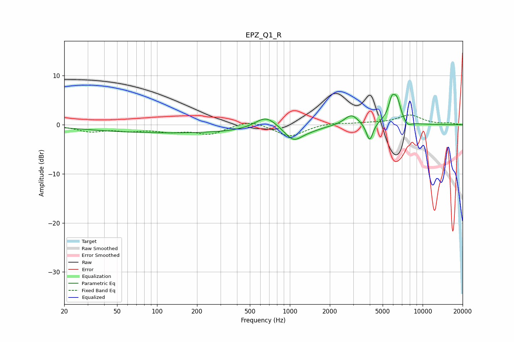

# EPZ_Q1_R
See [usage instructions](https://github.com/jaakkopasanen/AutoEq#usage) for more options and info.

### Parametric EQs
Apply preamp of -6.3 dB when using parametric equalizer.

|   # | Type    |   Fc (Hz) |    Q |   Gain (dB) |
|-----|---------|-----------|------|-------------|
|   1 | Peaking |       144 | 0.18 |        -1.7 |
|   2 | Peaking |       662 | 1.67 |         2.7 |
|   3 | Peaking |      1064 | 2.14 |        -2.8 |
|   4 | Peaking |      1417 | 1.51 |        -0.6 |
|   5 | Peaking |      2903 | 2.76 |         2.1 |
|   6 | Peaking |      3991 | 5.65 |        -3.8 |
|   7 | Peaking |      5595 | 1.96 |         0.8 |
|   8 | Peaking |      5859 | 5.8  |         3.2 |
|   9 | Peaking |      6406 | 4.55 |         4.1 |
|  10 | Peaking |      7682 | 4.5  |        -1   |

### Fixed Band EQs
When using fixed band (also called graphic) equalizer, apply preamp of **-2.1 dB** (if available) and set gains manually with these parameters.

|   # | Type    |   Fc (Hz) |    Q |   Gain (dB) |
|-----|---------|-----------|------|-------------|
|   1 | Peaking |        31 | 1.41 |        -1.3 |
|   2 | Peaking |        62 | 1.41 |        -1   |
|   3 | Peaking |       125 | 1.41 |        -1.1 |
|   4 | Peaking |       250 | 1.41 |        -1.8 |
|   5 | Peaking |       500 | 1.41 |         1.1 |
|   6 | Peaking |      1000 | 1.41 |        -2.4 |
|   7 | Peaking |      2000 | 1.41 |         0.4 |
|   8 | Peaking |      4000 | 1.41 |         0.3 |
|   9 | Peaking |      8000 | 1.41 |         1.9 |
|  10 | Peaking |     16000 | 1.41 |         0.3 |

### Graphs

