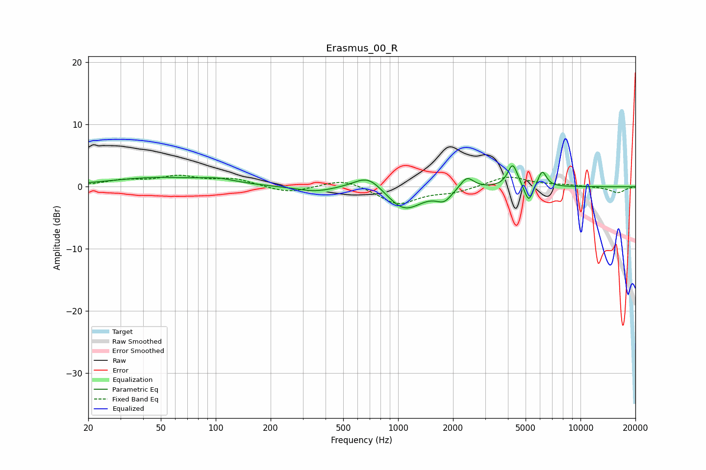

# Erasmus_00_R
See [usage instructions](https://github.com/jaakkopasanen/AutoEq#usage) for more options and info.

### Parametric EQs
Apply preamp of -3.4 dB when using parametric equalizer.

|   # | Type    |   Fc (Hz) |    Q |   Gain (dB) |
|-----|---------|-----------|------|-------------|
|   1 | Peaking |        48 | 0.55 |         1.4 |
|   2 | Peaking |       104 | 1.49 |         0.7 |
|   3 | Peaking |       350 | 1.39 |        -0.8 |
|   4 | Peaking |       687 | 1.79 |         2.5 |
|   5 | Peaking |      1080 | 1.46 |        -3.9 |
|   6 | Peaking |      1787 | 3.35 |        -1.7 |
|   7 | Peaking |      2382 | 3.86 |         2   |
|   8 | Peaking |      4249 | 5.16 |         3.7 |
|   9 | Peaking |      5204 | 6    |        -2.9 |
|  10 | Peaking |      6163 | 5.8  |         2.6 |

### Fixed Band EQs
When using fixed band (also called graphic) equalizer, apply preamp of **-2.0 dB** (if available) and set gains manually with these parameters.

|   # | Type    |   Fc (Hz) |    Q |   Gain (dB) |
|-----|---------|-----------|------|-------------|
|   1 | Peaking |        31 | 1.41 |         0.9 |
|   2 | Peaking |        62 | 1.41 |         1.5 |
|   3 | Peaking |       125 | 1.41 |         1.2 |
|   4 | Peaking |       250 | 1.41 |        -1.1 |
|   5 | Peaking |       500 | 1.41 |         1.3 |
|   6 | Peaking |      1000 | 1.41 |        -2.8 |
|   7 | Peaking |      2000 | 1.41 |        -0.8 |
|   8 | Peaking |      4000 | 1.41 |         1.7 |
|   9 | Peaking |      8000 | 1.41 |         0.2 |
|  10 | Peaking |     16000 | 1.41 |        -1   |

### Graphs

