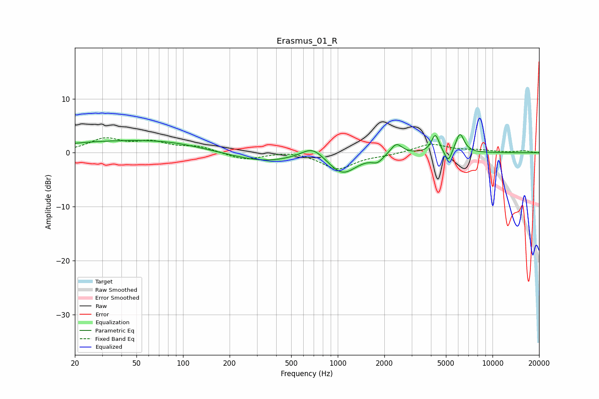

# Erasmus_01_R
See [usage instructions](https://github.com/jaakkopasanen/AutoEq#usage) for more options and info.

### Parametric EQs
Apply preamp of -3.4 dB when using parametric equalizer.

|   # | Type    |   Fc (Hz) |    Q |   Gain (dB) |
|-----|---------|-----------|------|-------------|
|   1 | Peaking |        28 | 0.42 |         1.7 |
|   2 | Peaking |        82 | 0.59 |         1.4 |
|   3 | Peaking |       331 | 0.69 |        -1.7 |
|   4 | Peaking |       688 | 1.93 |         2.3 |
|   5 | Peaking |      1073 | 1.56 |        -3.8 |
|   6 | Peaking |      1806 | 3.93 |        -1.2 |
|   7 | Peaking |      2390 | 3.84 |         2.1 |
|   8 | Peaking |      4272 | 5.7  |         3.4 |
|   9 | Peaking |      5178 | 6    |        -2.4 |
|  10 | Peaking |      6155 | 4.97 |         3.6 |

### Fixed Band EQs
When using fixed band (also called graphic) equalizer, apply preamp of **-2.9 dB** (if available) and set gains manually with these parameters.

|   # | Type    |   Fc (Hz) |    Q |   Gain (dB) |
|-----|---------|-----------|------|-------------|
|   1 | Peaking |        31 | 1.41 |         2.4 |
|   2 | Peaking |        62 | 1.41 |         1.7 |
|   3 | Peaking |       125 | 1.41 |         1.1 |
|   4 | Peaking |       250 | 1.41 |        -1.3 |
|   5 | Peaking |       500 | 1.41 |         0.4 |
|   6 | Peaking |      1000 | 1.41 |        -3   |
|   7 | Peaking |      2000 | 1.41 |        -0.4 |
|   8 | Peaking |      4000 | 1.41 |         1.6 |
|   9 | Peaking |      8000 | 1.41 |         0.4 |
|  10 | Peaking |     16000 | 1.41 |         0.3 |

### Graphs

