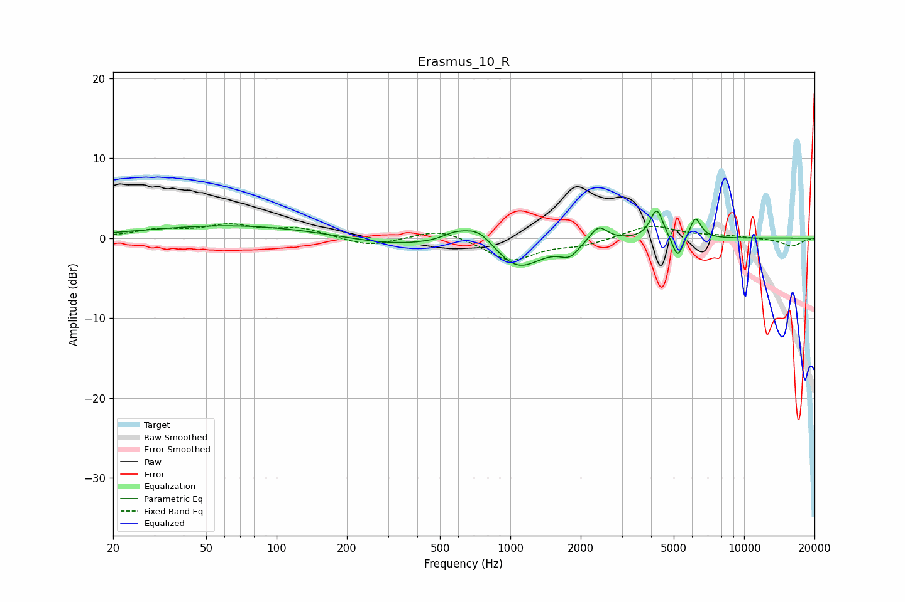

# Erasmus_10_R
See [usage instructions](https://github.com/jaakkopasanen/AutoEq#usage) for more options and info.

### Parametric EQs
Apply preamp of -3.5 dB when using parametric equalizer.

|   # | Type    |   Fc (Hz) |    Q |   Gain (dB) |
|-----|---------|-----------|------|-------------|
|   1 | Peaking |        65 | 0.38 |         1.6 |
|   2 | Peaking |       306 | 0.72 |        -0.9 |
|   3 | Peaking |       578 | 2.66 |         0.9 |
|   4 | Peaking |       732 | 2.1  |         2.3 |
|   5 | Peaking |      1074 | 1.37 |        -3.8 |
|   6 | Peaking |      1791 | 3.48 |        -1.6 |
|   7 | Peaking |      2383 | 3.84 |         2   |
|   8 | Peaking |      4230 | 5.19 |         3.7 |
|   9 | Peaking |      5202 | 6    |        -2.9 |
|  10 | Peaking |      6188 | 5.8  |         2.7 |

### Fixed Band EQs
When using fixed band (also called graphic) equalizer, apply preamp of **-1.9 dB** (if available) and set gains manually with these parameters.

|   # | Type    |   Fc (Hz) |    Q |   Gain (dB) |
|-----|---------|-----------|------|-------------|
|   1 | Peaking |        31 | 1.41 |         0.9 |
|   2 | Peaking |        62 | 1.41 |         1.4 |
|   3 | Peaking |       125 | 1.41 |         1.2 |
|   4 | Peaking |       250 | 1.41 |        -1.1 |
|   5 | Peaking |       500 | 1.41 |         1.3 |
|   6 | Peaking |      1000 | 1.41 |        -2.8 |
|   7 | Peaking |      2000 | 1.41 |        -0.8 |
|   8 | Peaking |      4000 | 1.41 |         1.7 |
|   9 | Peaking |      8000 | 1.41 |         0.3 |
|  10 | Peaking |     16000 | 1.41 |        -1   |

### Graphs

