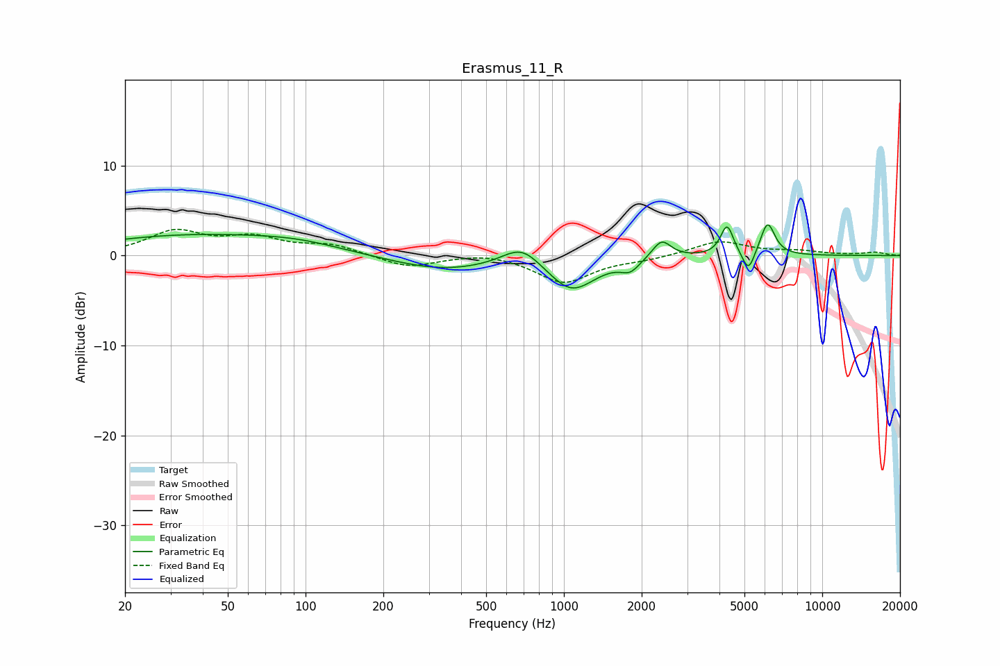

# Erasmus_11_R
See [usage instructions](https://github.com/jaakkopasanen/AutoEq#usage) for more options and info.

### Parametric EQs
Apply preamp of -3.5 dB when using parametric equalizer.

|   # | Type    |   Fc (Hz) |    Q |   Gain (dB) |
|-----|---------|-----------|------|-------------|
|   1 | Peaking |        34 | 0.4  |         2.1 |
|   2 | Peaking |        92 | 0.75 |         1   |
|   3 | Peaking |       339 | 0.7  |        -1.6 |
|   4 | Peaking |       687 | 1.9  |         2.3 |
|   5 | Peaking |      1071 | 1.54 |        -3.8 |
|   6 | Peaking |      1805 | 3.94 |        -1.2 |
|   7 | Peaking |      2389 | 3.93 |         2.1 |
|   8 | Peaking |      4283 | 5.74 |         3.4 |
|   9 | Peaking |      5181 | 6    |        -2.4 |
|  10 | Peaking |      6146 | 5    |         3.7 |

### Fixed Band EQs
When using fixed band (also called graphic) equalizer, apply preamp of **-3.0 dB** (if available) and set gains manually with these parameters.

|   # | Type    |   Fc (Hz) |    Q |   Gain (dB) |
|-----|---------|-----------|------|-------------|
|   1 | Peaking |        31 | 1.41 |         2.6 |
|   2 | Peaking |        62 | 1.41 |         1.8 |
|   3 | Peaking |       125 | 1.41 |         1.1 |
|   4 | Peaking |       250 | 1.41 |        -1.3 |
|   5 | Peaking |       500 | 1.41 |         0.4 |
|   6 | Peaking |      1000 | 1.41 |        -3   |
|   7 | Peaking |      2000 | 1.41 |        -0.4 |
|   8 | Peaking |      4000 | 1.41 |         1.6 |
|   9 | Peaking |      8000 | 1.41 |         0.4 |
|  10 | Peaking |     16000 | 1.41 |         0.3 |

### Graphs

