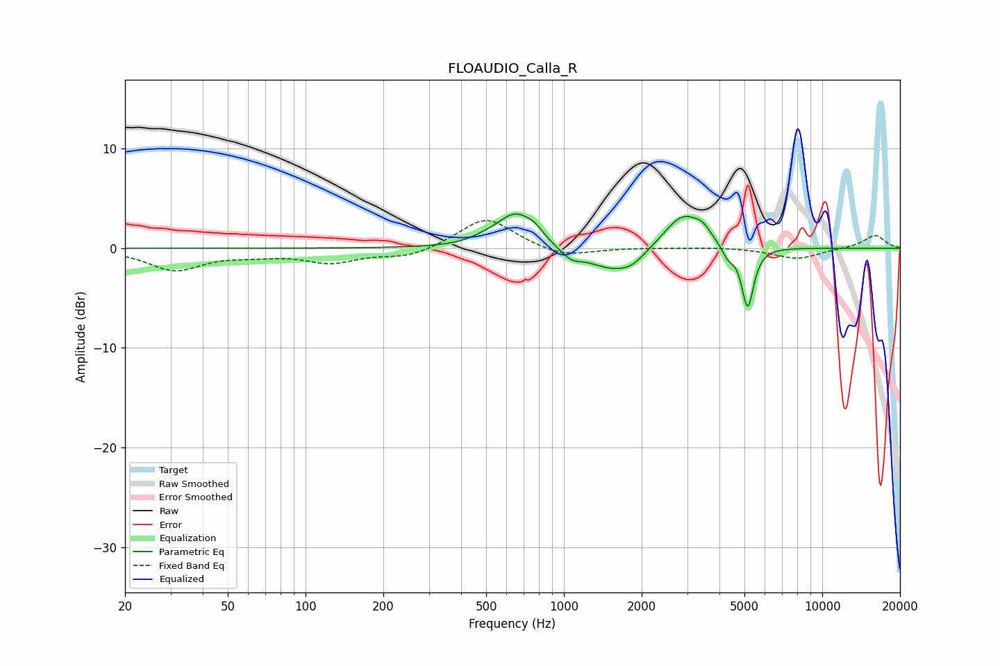

# FLOAUDIO_Calla_R
See [usage instructions](https://github.com/jaakkopasanen/AutoEq#usage) for more options and info.

### Parametric EQs
Apply preamp of -3.5 dB when using parametric equalizer.

|   # | Type    |   Fc (Hz) |    Q |   Gain (dB) |
|-----|---------|-----------|------|-------------|
|   1 | Peaking |       494 | 2.44 |         0.4 |
|   2 | Peaking |       649 | 2    |         3.4 |
|   3 | Peaking |       773 | 4.06 |         0.8 |
|   4 | Peaking |      1065 | 3.65 |        -0.9 |
|   5 | Peaking |      1573 | 1.32 |        -2.4 |
|   6 | Peaking |      1838 | 3.24 |        -0.6 |
|   7 | Peaking |      2898 | 1.82 |         3.7 |
|   8 | Peaking |      3446 | 5.05 |         0.8 |
|   9 | Peaking |      4312 | 6    |        -1.2 |
|  10 | Peaking |      5145 | 6    |        -6.2 |

### Fixed Band EQs
When using fixed band (also called graphic) equalizer, apply preamp of **-2.9 dB** (if available) and set gains manually with these parameters.

|   # | Type    |   Fc (Hz) |    Q |   Gain (dB) |
|-----|---------|-----------|------|-------------|
|   1 | Peaking |        31 | 1.41 |        -2.1 |
|   2 | Peaking |        62 | 1.41 |        -0.5 |
|   3 | Peaking |       125 | 1.41 |        -1.3 |
|   4 | Peaking |       250 | 1.41 |        -0.9 |
|   5 | Peaking |       500 | 1.41 |         3.2 |
|   6 | Peaking |      1000 | 1.41 |        -1   |
|   7 | Peaking |      2000 | 1.41 |         0   |
|   8 | Peaking |      4000 | 1.41 |         0.1 |
|   9 | Peaking |      8000 | 1.41 |        -1.1 |
|  10 | Peaking |     16000 | 1.41 |         1.3 |

### Graphs

