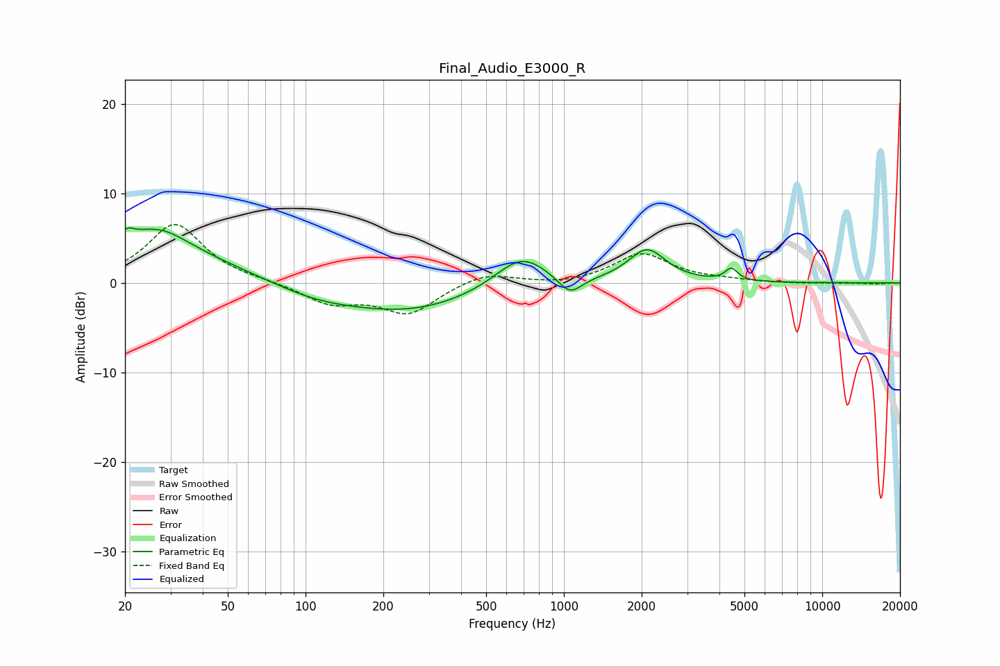

# Final_Audio_E3000_R
See [usage instructions](https://github.com/jaakkopasanen/AutoEq#usage) for more options and info.

### Parametric EQs
Apply preamp of -6.2 dB when using parametric equalizer.

|   # | Type    |   Fc (Hz) |    Q |   Gain (dB) |
|-----|---------|-----------|------|-------------|
|   1 | Peaking |        21 | 5.88 |         3.1 |
|   2 | Peaking |        21 | 5.99 |        -2.5 |
|   3 | Peaking |        22 | 0.49 |         5   |
|   4 | Peaking |        28 | 1.58 |         1.3 |
|   5 | Peaking |       108 | 0.86 |        -1.1 |
|   6 | Peaking |       250 | 0.53 |        -3.1 |
|   7 | Peaking |       685 | 1.37 |         3.7 |
|   8 | Peaking |      1054 | 3.02 |        -2.1 |
|   9 | Peaking |      2098 | 1.98 |         3.7 |
|  10 | Peaking |      4452 | 6    |         1.4 |

### Fixed Band EQs
When using fixed band (also called graphic) equalizer, apply preamp of **-6.6 dB** (if available) and set gains manually with these parameters.

|   # | Type    |   Fc (Hz) |    Q |   Gain (dB) |
|-----|---------|-----------|------|-------------|
|   1 | Peaking |        31 | 1.41 |         6.6 |
|   2 | Peaking |        62 | 1.41 |         0.1 |
|   3 | Peaking |       125 | 1.41 |        -2.2 |
|   4 | Peaking |       250 | 1.41 |        -3.3 |
|   5 | Peaking |       500 | 1.41 |         1.3 |
|   6 | Peaking |      1000 | 1.41 |        -0.3 |
|   7 | Peaking |      2000 | 1.41 |         3.3 |
|   8 | Peaking |      4000 | 1.41 |         0.2 |
|   9 | Peaking |      8000 | 1.41 |        -0.1 |
|  10 | Peaking |     16000 | 1.41 |        -0.1 |

### Graphs

