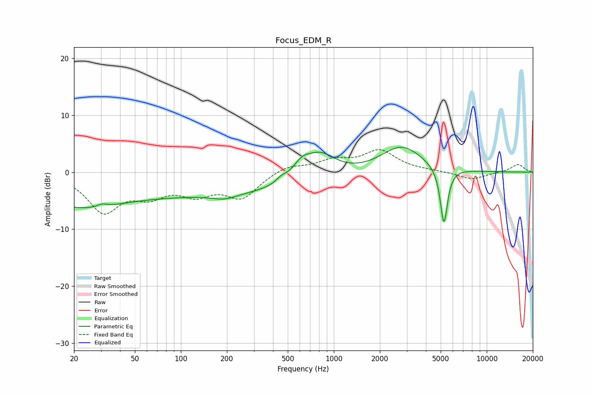

# Focus_EDM_R
See [usage instructions](https://github.com/jaakkopasanen/AutoEq#usage) for more options and info.

### Parametric EQs
Apply preamp of -4.5 dB when using parametric equalizer.

|   # | Type    |   Fc (Hz) |    Q |   Gain (dB) |
|-----|---------|-----------|------|-------------|
|   1 | Peaking |        20 | 0.51 |        -5.1 |
|   2 | Peaking |        31 | 4.58 |         0.5 |
|   3 | Peaking |       183 | 0.18 |        -3.9 |
|   4 | Peaking |       193 | 1.84 |        -0.8 |
|   5 | Peaking |       454 | 4.2  |         0.8 |
|   6 | Peaking |       613 | 2.55 |         2.1 |
|   7 | Peaking |       805 | 1.29 |         4.9 |
|   8 | Peaking |      2775 | 1.04 |         4.7 |
|   9 | Peaking |      5185 | 4.54 |        -0.9 |
|  10 | Peaking |      5251 | 6    |        -9.3 |

### Fixed Band EQs
When using fixed band (also called graphic) equalizer, apply preamp of **-4.1 dB** (if available) and set gains manually with these parameters.

|   # | Type    |   Fc (Hz) |    Q |   Gain (dB) |
|-----|---------|-----------|------|-------------|
|   1 | Peaking |        31 | 1.41 |        -6.6 |
|   2 | Peaking |        62 | 1.41 |        -3.2 |
|   3 | Peaking |       125 | 1.41 |        -3.2 |
|   4 | Peaking |       250 | 1.41 |        -4.2 |
|   5 | Peaking |       500 | 1.41 |         1.3 |
|   6 | Peaking |      1000 | 1.41 |         1.8 |
|   7 | Peaking |      2000 | 1.41 |         3.6 |
|   8 | Peaking |      4000 | 1.41 |         0.2 |
|   9 | Peaking |      8000 | 1.41 |        -1.3 |
|  10 | Peaking |     16000 | 1.41 |         1.4 |

### Graphs

