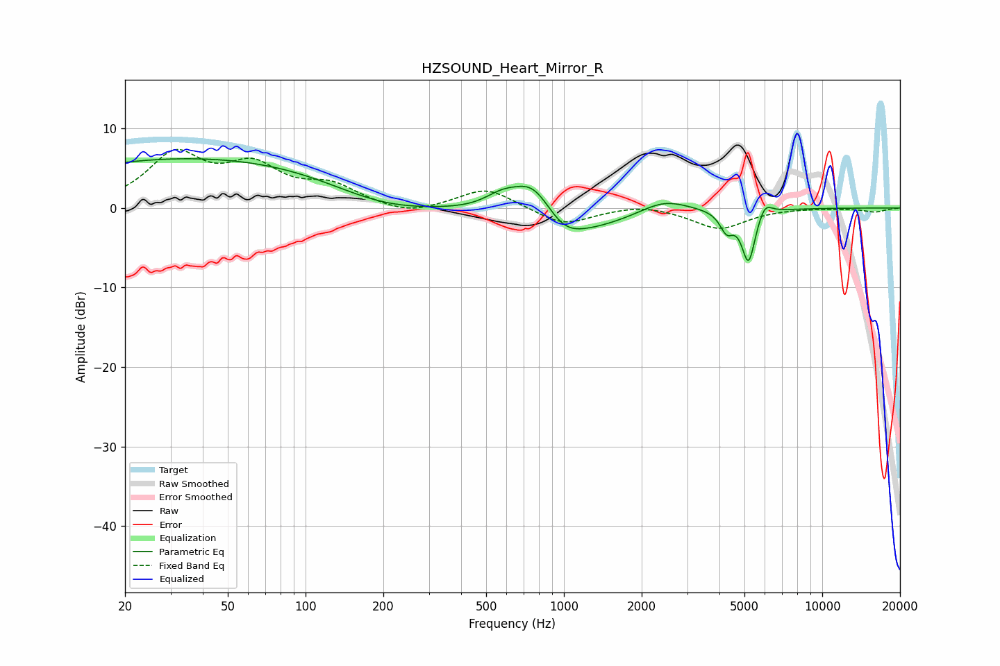

# HZSOUND_Heart_Mirror_R
See [usage instructions](https://github.com/jaakkopasanen/AutoEq#usage) for more options and info.

### Parametric EQs
Apply preamp of -6.3 dB when using parametric equalizer.

|   # | Type    |   Fc (Hz) |    Q |   Gain (dB) |
|-----|---------|-----------|------|-------------|
|   1 | Peaking |        46 | 0.18 |         6.5 |
|   2 | Peaking |       195 | 0.62 |        -3.2 |
|   3 | Peaking |       576 | 2.01 |         1.9 |
|   4 | Peaking |       761 | 1.74 |         5   |
|   5 | Peaking |       998 | 2.03 |        -1.6 |
|   6 | Peaking |      1032 | 0.69 |        -3.6 |
|   7 | Peaking |      2438 | 1.47 |         1.8 |
|   8 | Peaking |      4267 | 5.41 |        -2.4 |
|   9 | Peaking |      5185 | 5.35 |        -6.7 |
|  10 | Peaking |      5996 | 5.17 |         1.7 |

### Fixed Band EQs
When using fixed band (also called graphic) equalizer, apply preamp of **-7.4 dB** (if available) and set gains manually with these parameters.

|   # | Type    |   Fc (Hz) |    Q |   Gain (dB) |
|-----|---------|-----------|------|-------------|
|   1 | Peaking |        31 | 1.41 |         6.4 |
|   2 | Peaking |        62 | 1.41 |         4.6 |
|   3 | Peaking |       125 | 1.41 |         2.5 |
|   4 | Peaking |       250 | 1.41 |        -1.1 |
|   5 | Peaking |       500 | 1.41 |         2.6 |
|   6 | Peaking |      1000 | 1.41 |        -2.2 |
|   7 | Peaking |      2000 | 1.41 |         0.6 |
|   8 | Peaking |      4000 | 1.41 |        -2.6 |
|   9 | Peaking |      8000 | 1.41 |         0   |
|  10 | Peaking |     16000 | 1.41 |        -0.5 |

### Graphs

