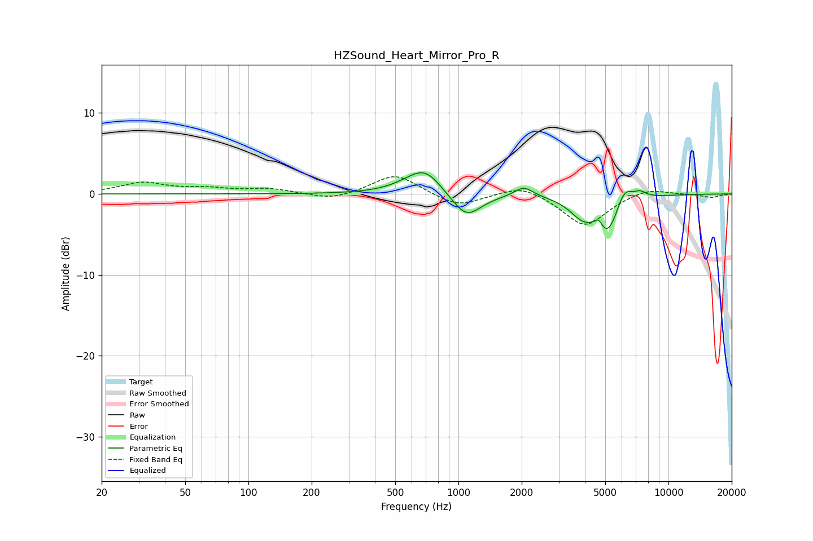

# HZSound_Heart_Mirror_Pro_R
See [usage instructions](https://github.com/jaakkopasanen/AutoEq#usage) for more options and info.

### Parametric EQs
Apply preamp of -2.7 dB when using parametric equalizer.

|   # | Type    |   Fc (Hz) |    Q |   Gain (dB) |
|-----|---------|-----------|------|-------------|
|   1 | Peaking |       593 | 1.47 |         0.8 |
|   2 | Peaking |       698 | 1.84 |         2.6 |
|   3 | Peaking |      1091 | 2.11 |        -2.6 |
|   4 | Peaking |      1091 | 1.48 |        -0.5 |
|   5 | Peaking |      2050 | 3.16 |         1.3 |
|   6 | Peaking |      3857 | 2.39 |        -1.8 |
|   7 | Peaking |      4650 | 6    |         1.7 |
|   8 | Peaking |      5070 | 2.19 |        -5.3 |
|   9 | Peaking |      6141 | 3.39 |         2.7 |
|  10 | Peaking |      7325 | 4.52 |         0.8 |

### Fixed Band EQs
When using fixed band (also called graphic) equalizer, apply preamp of **-2.2 dB** (if available) and set gains manually with these parameters.

|   # | Type    |   Fc (Hz) |    Q |   Gain (dB) |
|-----|---------|-----------|------|-------------|
|   1 | Peaking |        31 | 1.41 |         1.3 |
|   2 | Peaking |        62 | 1.41 |         0.6 |
|   3 | Peaking |       125 | 1.41 |         0.6 |
|   4 | Peaking |       250 | 1.41 |        -0.8 |
|   5 | Peaking |       500 | 1.41 |         2.5 |
|   6 | Peaking |      1000 | 1.41 |        -1.6 |
|   7 | Peaking |      2000 | 1.41 |         1.3 |
|   8 | Peaking |      4000 | 1.41 |        -4   |
|   9 | Peaking |      8000 | 1.41 |         0.8 |
|  10 | Peaking |     16000 | 1.41 |        -0.4 |

### Graphs

