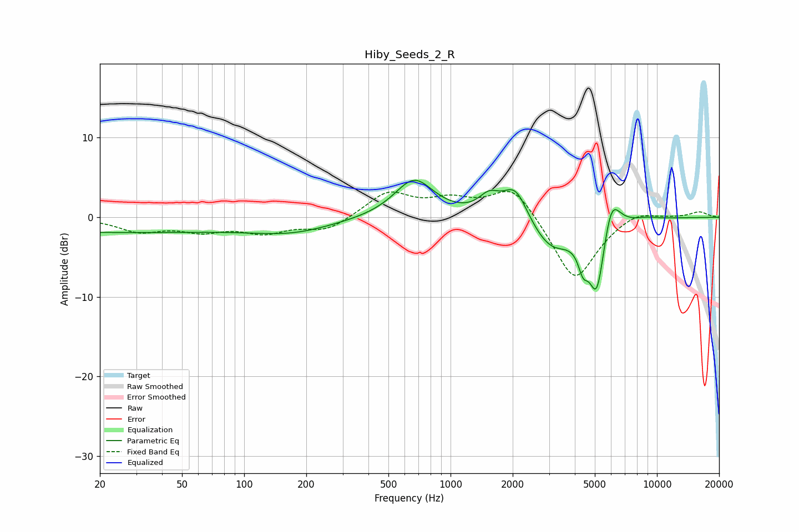

# Hiby_Seeds_2_R
See [usage instructions](https://github.com/jaakkopasanen/AutoEq#usage) for more options and info.

### Parametric EQs
Apply preamp of -4.7 dB when using parametric equalizer.

|   # | Type    |   Fc (Hz) |    Q |   Gain (dB) |
|-----|---------|-----------|------|-------------|
|   1 | Peaking |        22 | 0.18 |        -1.9 |
|   2 | Peaking |       174 | 0.71 |        -1.5 |
|   3 | Peaking |       666 | 1.48 |         4.8 |
|   4 | Peaking |      1540 | 2.76 |         2.2 |
|   5 | Peaking |      2062 | 2.31 |         4.3 |
|   6 | Peaking |      3066 | 1.37 |        -4   |
|   7 | Peaking |      4383 | 5.9  |        -2.7 |
|   8 | Peaking |      5115 | 3.37 |        -9.4 |
|   9 | Peaking |      5993 | 3.27 |         5   |
|  10 | Peaking |      8953 | 2.58 |         0.2 |

### Fixed Band EQs
When using fixed band (also called graphic) equalizer, apply preamp of **-3.3 dB** (if available) and set gains manually with these parameters.

|   # | Type    |   Fc (Hz) |    Q |   Gain (dB) |
|-----|---------|-----------|------|-------------|
|   1 | Peaking |        31 | 1.41 |        -1.6 |
|   2 | Peaking |        62 | 1.41 |        -1.5 |
|   3 | Peaking |       125 | 1.41 |        -1.7 |
|   4 | Peaking |       250 | 1.41 |        -1.7 |
|   5 | Peaking |       500 | 1.41 |         3.1 |
|   6 | Peaking |      1000 | 1.41 |         1.8 |
|   7 | Peaking |      2000 | 1.41 |         4.2 |
|   8 | Peaking |      4000 | 1.41 |        -8.3 |
|   9 | Peaking |      8000 | 1.41 |         1.1 |
|  10 | Peaking |     16000 | 1.41 |         0.7 |

### Graphs

