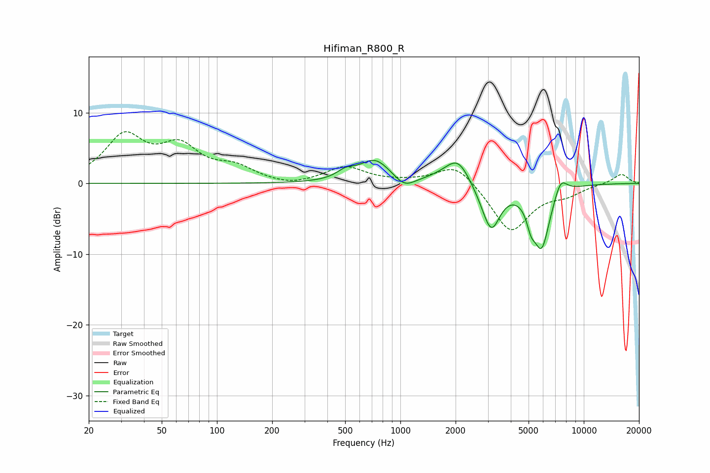

# Hifiman_R800_R
See [usage instructions](https://github.com/jaakkopasanen/AutoEq#usage) for more options and info.

### Parametric EQs
Apply preamp of -3.4 dB when using parametric equalizer.

|   # | Type    |   Fc (Hz) |    Q |   Gain (dB) |
|-----|---------|-----------|------|-------------|
|   1 | Peaking |       503 | 2.92 |         1.1 |
|   2 | Peaking |       727 | 1.69 |         3.3 |
|   3 | Peaking |      1052 | 2.57 |        -1.5 |
|   4 | Peaking |      1745 | 1.59 |         0.7 |
|   5 | Peaking |      2066 | 2.2  |         3.3 |
|   6 | Peaking |      2928 | 2.31 |        -1.1 |
|   7 | Peaking |      3139 | 2.96 |        -5.5 |
|   8 | Peaking |      5152 | 6    |        -2.3 |
|   9 | Peaking |      5887 | 2.92 |        -8.8 |
|  10 | Peaking |      7472 | 3.84 |         2.5 |

### Fixed Band EQs
When using fixed band (also called graphic) equalizer, apply preamp of **-7.4 dB** (if available) and set gains manually with these parameters.

|   # | Type    |   Fc (Hz) |    Q |   Gain (dB) |
|-----|---------|-----------|------|-------------|
|   1 | Peaking |        31 | 1.41 |         6.4 |
|   2 | Peaking |        62 | 1.41 |         4.6 |
|   3 | Peaking |       125 | 1.41 |         1.9 |
|   4 | Peaking |       250 | 1.41 |        -0.6 |
|   5 | Peaking |       500 | 1.41 |         2.3 |
|   6 | Peaking |      1000 | 1.41 |         0.1 |
|   7 | Peaking |      2000 | 1.41 |         3   |
|   8 | Peaking |      4000 | 1.41 |        -6.9 |
|   9 | Peaking |      8000 | 1.41 |        -1.2 |
|  10 | Peaking |     16000 | 1.41 |         1.4 |

### Graphs

