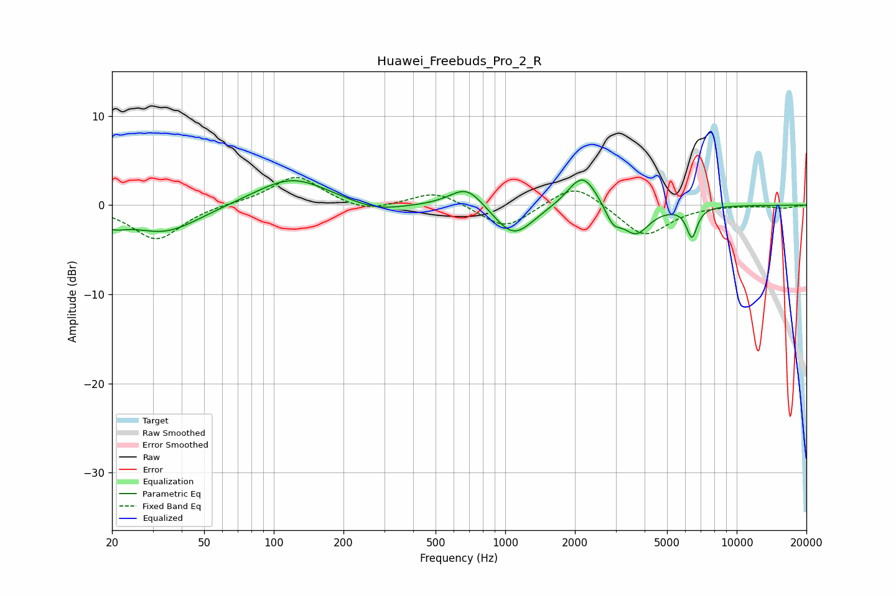

# Huawei_Freebuds_Pro_2_R
See [usage instructions](https://github.com/jaakkopasanen/AutoEq#usage) for more options and info.

### Parametric EQs
Apply preamp of -2.9 dB when using parametric equalizer.

|   # | Type    |   Fc (Hz) |    Q |   Gain (dB) |
|-----|---------|-----------|------|-------------|
|   1 | Peaking |        20 | 2.47 |        -1.3 |
|   2 | Peaking |        34 | 0.92 |        -3.1 |
|   3 | Peaking |       120 | 0.89 |         3.2 |
|   4 | Peaking |       276 | 1.16 |        -1   |
|   5 | Peaking |       683 | 1.93 |         2.5 |
|   6 | Peaking |      1087 | 1.66 |        -3.7 |
|   7 | Peaking |      2159 | 2.21 |         3.9 |
|   8 | Peaking |      2922 | 4.1  |        -1.9 |
|   9 | Peaking |      3669 | 2.4  |        -3.2 |
|  10 | Peaking |      6402 | 6    |        -3.4 |

### Fixed Band EQs
When using fixed band (also called graphic) equalizer, apply preamp of **-3.2 dB** (if available) and set gains manually with these parameters.

|   # | Type    |   Fc (Hz) |    Q |   Gain (dB) |
|-----|---------|-----------|------|-------------|
|   1 | Peaking |        31 | 1.41 |        -3.9 |
|   2 | Peaking |        62 | 1.41 |         0.2 |
|   3 | Peaking |       125 | 1.41 |         3.3 |
|   4 | Peaking |       250 | 1.41 |        -0.9 |
|   5 | Peaking |       500 | 1.41 |         1.6 |
|   6 | Peaking |      1000 | 1.41 |        -2.8 |
|   7 | Peaking |      2000 | 1.41 |         2.6 |
|   8 | Peaking |      4000 | 1.41 |        -3.6 |
|   9 | Peaking |      8000 | 1.41 |         0   |
|  10 | Peaking |     16000 | 1.41 |        -0.3 |

### Graphs

