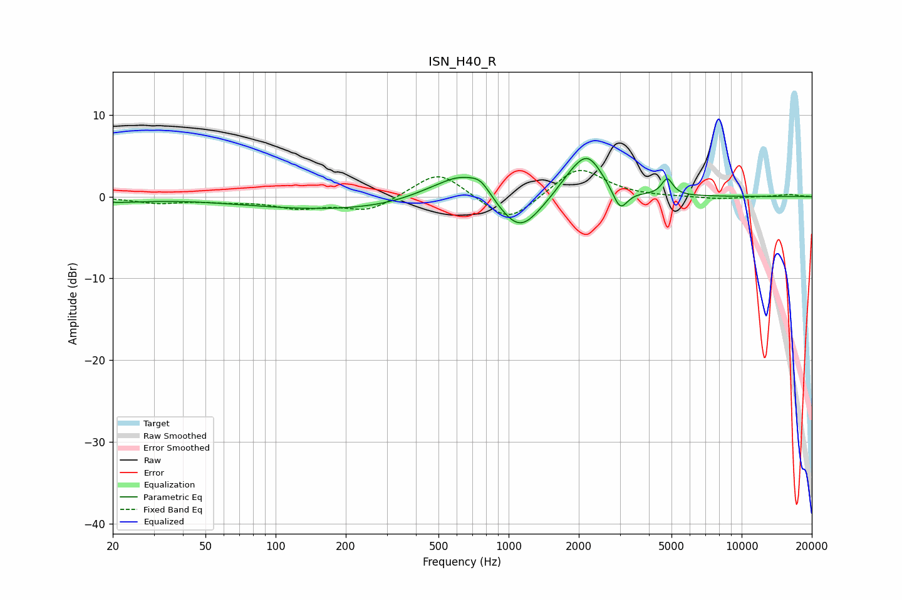

# ISN_H40_R
See [usage instructions](https://github.com/jaakkopasanen/AutoEq#usage) for more options and info.

### Parametric EQs
Apply preamp of -4.8 dB when using parametric equalizer.

|   # | Type    |   Fc (Hz) |    Q |   Gain (dB) |
|-----|---------|-----------|------|-------------|
|   1 | Peaking |        20 | 1.02 |        -0.6 |
|   2 | Peaking |       186 | 0.36 |        -1.6 |
|   3 | Peaking |       454 | 1.17 |         0.8 |
|   4 | Peaking |       627 | 1.4  |         2.9 |
|   5 | Peaking |       759 | 3.31 |         1.4 |
|   6 | Peaking |      1116 | 1.58 |        -4.6 |
|   7 | Peaking |      1815 | 2.19 |         1.2 |
|   8 | Peaking |      2183 | 2.12 |         4.8 |
|   9 | Peaking |      3011 | 4.58 |        -2.7 |
|  10 | Peaking |      4794 | 6    |         2   |

### Fixed Band EQs
When using fixed band (also called graphic) equalizer, apply preamp of **-3.3 dB** (if available) and set gains manually with these parameters.

|   # | Type    |   Fc (Hz) |    Q |   Gain (dB) |
|-----|---------|-----------|------|-------------|
|   1 | Peaking |        31 | 1.41 |        -0.7 |
|   2 | Peaking |        62 | 1.41 |        -0.5 |
|   3 | Peaking |       125 | 1.41 |        -1.2 |
|   4 | Peaking |       250 | 1.41 |        -1.7 |
|   5 | Peaking |       500 | 1.41 |         3.3 |
|   6 | Peaking |      1000 | 1.41 |        -3.4 |
|   7 | Peaking |      2000 | 1.41 |         3.7 |
|   8 | Peaking |      4000 | 1.41 |        -0.1 |
|   9 | Peaking |      8000 | 1.41 |        -0.3 |
|  10 | Peaking |     16000 | 1.41 |         0.3 |

### Graphs

