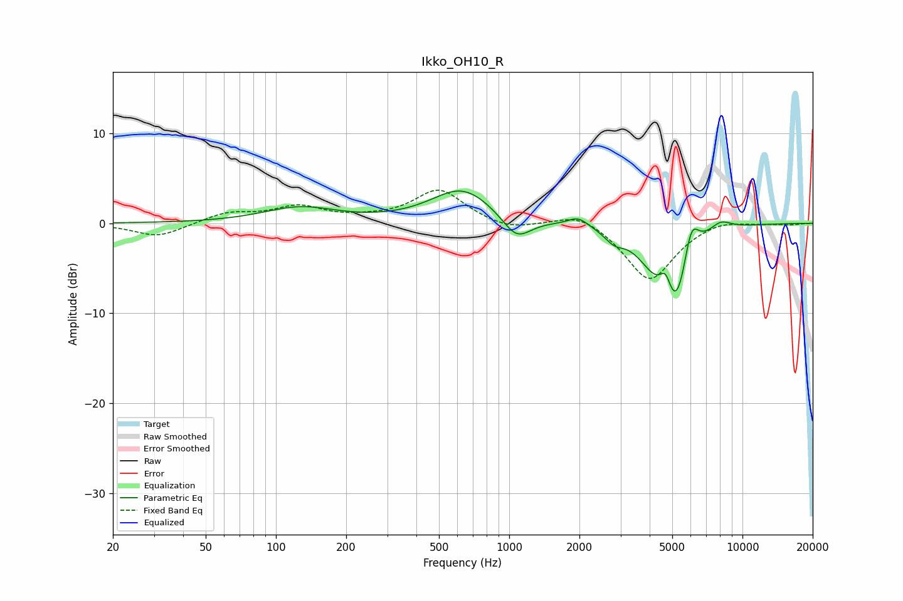

# Ikko_OH10_R
See [usage instructions](https://github.com/jaakkopasanen/AutoEq#usage) for more options and info.

### Parametric EQs
Apply preamp of -3.7 dB when using parametric equalizer.

|   # | Type    |   Fc (Hz) |    Q |   Gain (dB) |
|-----|---------|-----------|------|-------------|
|   1 | Peaking |       127 | 0.9  |         1.7 |
|   2 | Peaking |       631 | 1.06 |         3.9 |
|   3 | Peaking |      1075 | 2.27 |        -2.7 |
|   4 | Peaking |      1977 | 3.27 |         1   |
|   5 | Peaking |      2821 | 3.4  |        -1.2 |
|   6 | Peaking |      4184 | 1.82 |        -3.1 |
|   7 | Peaking |      4684 | 6    |         2.3 |
|   8 | Peaking |      5209 | 2.37 |        -8.1 |
|   9 | Peaking |      6022 | 4.22 |         4.4 |
|  10 | Peaking |      8055 | 2.82 |         1.1 |

### Fixed Band EQs
When using fixed band (also called graphic) equalizer, apply preamp of **-3.8 dB** (if available) and set gains manually with these parameters.

|   # | Type    |   Fc (Hz) |    Q |   Gain (dB) |
|-----|---------|-----------|------|-------------|
|   1 | Peaking |        31 | 1.41 |        -1.5 |
|   2 | Peaking |        62 | 1.41 |         1.1 |
|   3 | Peaking |       125 | 1.41 |         1.7 |
|   4 | Peaking |       250 | 1.41 |         0.3 |
|   5 | Peaking |       500 | 1.41 |         3.7 |
|   6 | Peaking |      1000 | 1.41 |        -0.9 |
|   7 | Peaking |      2000 | 1.41 |         1.4 |
|   8 | Peaking |      4000 | 1.41 |        -6.5 |
|   9 | Peaking |      8000 | 1.41 |         0.6 |
|  10 | Peaking |     16000 | 1.41 |        -0.1 |

### Graphs

