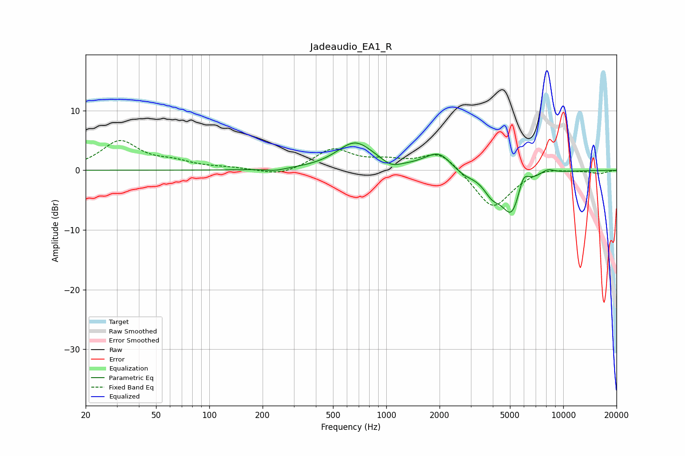

# Jadeaudio_EA1_R
See [usage instructions](https://github.com/jaakkopasanen/AutoEq#usage) for more options and info.

### Parametric EQs
Apply preamp of -4.7 dB when using parametric equalizer.

|   # | Type    |   Fc (Hz) |    Q |   Gain (dB) |
|-----|---------|-----------|------|-------------|
|   1 | Peaking |       236 | 2.75 |        -0.4 |
|   2 | Peaking |       667 | 1.35 |         4.6 |
|   3 | Peaking |      1067 | 2.94 |        -1   |
|   4 | Peaking |      1679 | 1.85 |         0.6 |
|   5 | Peaking |      1997 | 2.11 |         2.5 |
|   6 | Peaking |      2767 | 2.45 |        -0.8 |
|   7 | Peaking |      3966 | 2.83 |        -2.7 |
|   8 | Peaking |      5130 | 2.35 |        -7.2 |
|   9 | Peaking |      5945 | 4.42 |         3.2 |
|  10 | Peaking |      8162 | 3.4  |         0.8 |

### Fixed Band EQs
When using fixed band (also called graphic) equalizer, apply preamp of **-5.1 dB** (if available) and set gains manually with these parameters.

|   # | Type    |   Fc (Hz) |    Q |   Gain (dB) |
|-----|---------|-----------|------|-------------|
|   1 | Peaking |        31 | 1.41 |         4.8 |
|   2 | Peaking |        62 | 1.41 |         1.1 |
|   3 | Peaking |       125 | 1.41 |         0.3 |
|   4 | Peaking |       250 | 1.41 |        -1.1 |
|   5 | Peaking |       500 | 1.41 |         3.5 |
|   6 | Peaking |      1000 | 1.41 |         1.2 |
|   7 | Peaking |      2000 | 1.41 |         3.3 |
|   8 | Peaking |      4000 | 1.41 |        -6.6 |
|   9 | Peaking |      8000 | 1.41 |         0.7 |
|  10 | Peaking |     16000 | 1.41 |        -0.5 |

### Graphs

