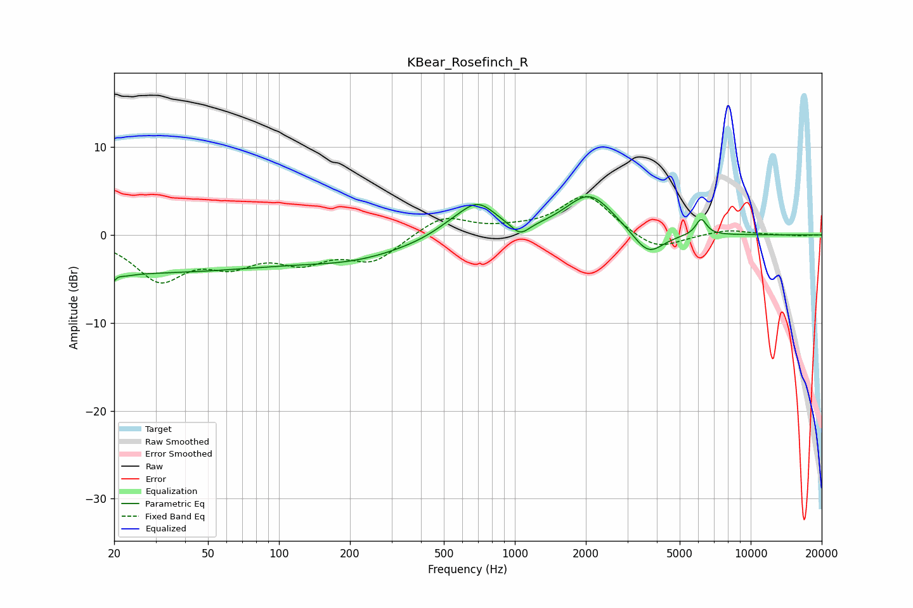

# KBear_Rosefinch_R
See [usage instructions](https://github.com/jaakkopasanen/AutoEq#usage) for more options and info.

### Parametric EQs
Apply preamp of -4.4 dB when using parametric equalizer.

|   # | Type    |   Fc (Hz) |    Q |   Gain (dB) |
|-----|---------|-----------|------|-------------|
|   1 | Peaking |        20 | 4.96 |        -4.2 |
|   2 | Peaking |        20 | 5.76 |         3.3 |
|   3 | Peaking |        22 | 0.18 |        -4.2 |
|   4 | Peaking |       215 | 0.61 |        -2   |
|   5 | Peaking |       546 | 1.56 |         1   |
|   6 | Peaking |       699 | 1.83 |         3.2 |
|   7 | Peaking |      1054 | 3.66 |        -1.4 |
|   8 | Peaking |      2072 | 1.38 |         4.6 |
|   9 | Peaking |      3679 | 2.15 |        -2.8 |
|  10 | Peaking |      6167 | 6    |         1.8 |

### Fixed Band EQs
When using fixed band (also called graphic) equalizer, apply preamp of **-4.5 dB** (if available) and set gains manually with these parameters.

|   # | Type    |   Fc (Hz) |    Q |   Gain (dB) |
|-----|---------|-----------|------|-------------|
|   1 | Peaking |        31 | 1.41 |        -4.8 |
|   2 | Peaking |        62 | 1.41 |        -2.7 |
|   3 | Peaking |       125 | 1.41 |        -2.6 |
|   4 | Peaking |       250 | 1.41 |        -2.8 |
|   5 | Peaking |       500 | 1.41 |         2.2 |
|   6 | Peaking |      1000 | 1.41 |         0.4 |
|   7 | Peaking |      2000 | 1.41 |         4.6 |
|   8 | Peaking |      4000 | 1.41 |        -2   |
|   9 | Peaking |      8000 | 1.41 |         0.6 |
|  10 | Peaking |     16000 | 1.41 |        -0.1 |

### Graphs

