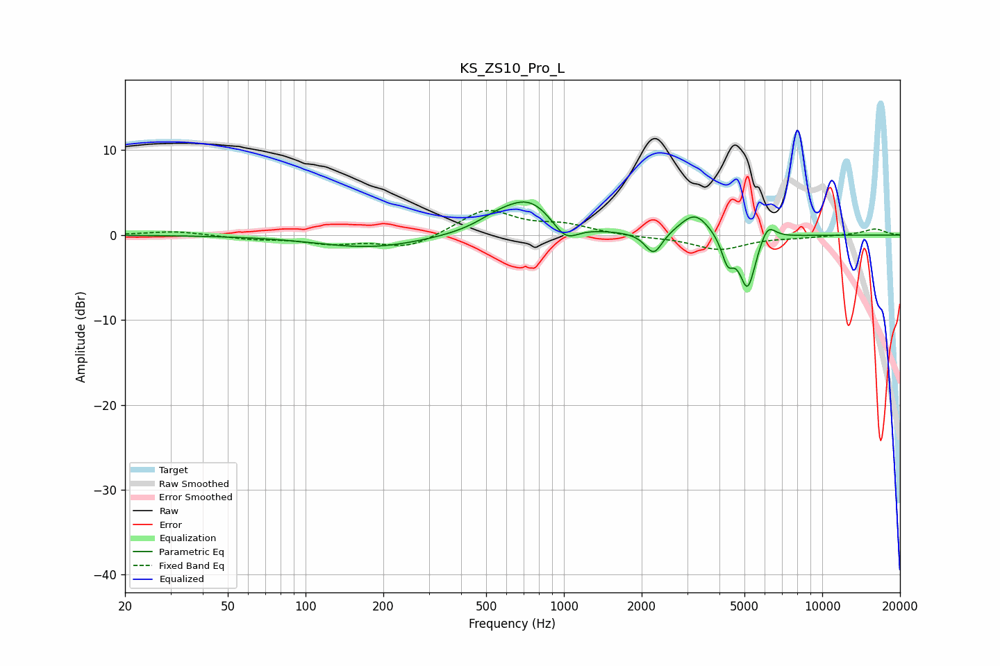

# KS_ZS10_Pro_L
See [usage instructions](https://github.com/jaakkopasanen/AutoEq#usage) for more options and info.

### Parametric EQs
Apply preamp of -4.0 dB when using parametric equalizer.

|   # | Type    |   Fc (Hz) |    Q |   Gain (dB) |
|-----|---------|-----------|------|-------------|
|   1 | Peaking |       179 | 0.68 |        -1.5 |
|   2 | Peaking |       551 | 1.74 |         1   |
|   3 | Peaking |       737 | 1.41 |         3.8 |
|   4 | Peaking |       931 | 0.79 |         0.2 |
|   5 | Peaking |      1012 | 2.81 |        -2.3 |
|   6 | Peaking |      2227 | 4.31 |        -2.7 |
|   7 | Peaking |      3216 | 2.43 |         2.7 |
|   8 | Peaking |      4305 | 5.99 |        -3   |
|   9 | Peaking |      5142 | 4.39 |        -6.4 |
|  10 | Peaking |      6141 | 4.51 |         2   |

### Fixed Band EQs
When using fixed band (also called graphic) equalizer, apply preamp of **-3.0 dB** (if available) and set gains manually with these parameters.

|   # | Type    |   Fc (Hz) |    Q |   Gain (dB) |
|-----|---------|-----------|------|-------------|
|   1 | Peaking |        31 | 1.41 |         0.5 |
|   2 | Peaking |        62 | 1.41 |        -0.4 |
|   3 | Peaking |       125 | 1.41 |        -0.9 |
|   4 | Peaking |       250 | 1.41 |        -1.5 |
|   5 | Peaking |       500 | 1.41 |         3   |
|   6 | Peaking |      1000 | 1.41 |         1.1 |
|   7 | Peaking |      2000 | 1.41 |        -0.2 |
|   8 | Peaking |      4000 | 1.41 |        -1.7 |
|   9 | Peaking |      8000 | 1.41 |        -0.2 |
|  10 | Peaking |     16000 | 1.41 |         0.7 |

### Graphs

