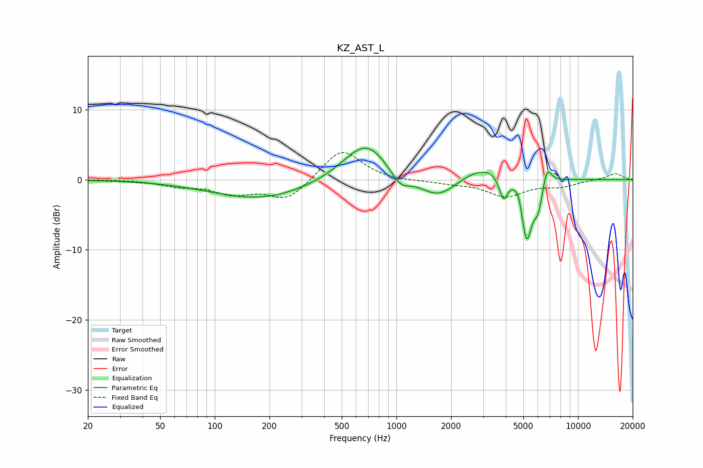

# KZ_AST_L
See [usage instructions](https://github.com/jaakkopasanen/AutoEq#usage) for more options and info.

### Parametric EQs
Apply preamp of -4.6 dB when using parametric equalizer.

|   # | Type    |   Fc (Hz) |    Q |   Gain (dB) |
|-----|---------|-----------|------|-------------|
|   1 | Peaking |       179 | 0.53 |        -2.8 |
|   2 | Peaking |       677 | 1.14 |         5.7 |
|   3 | Peaking |      1048 | 2.71 |        -2.1 |
|   4 | Peaking |      1704 | 1.31 |        -3.3 |
|   5 | Peaking |      3128 | 0.9  |         2.5 |
|   6 | Peaking |      3882 | 6    |        -3.4 |
|   7 | Peaking |      4712 | 6    |         1.6 |
|   8 | Peaking |      5210 | 4.41 |        -9.4 |
|   9 | Peaking |      6043 | 5.88 |        -3.4 |
|  10 | Peaking |      6751 | 5.54 |         2.7 |

### Fixed Band EQs
When using fixed band (also called graphic) equalizer, apply preamp of **-4.0 dB** (if available) and set gains manually with these parameters.

|   # | Type    |   Fc (Hz) |    Q |   Gain (dB) |
|-----|---------|-----------|------|-------------|
|   1 | Peaking |        31 | 1.41 |         0.1 |
|   2 | Peaking |        62 | 1.41 |        -0.8 |
|   3 | Peaking |       125 | 1.41 |        -1.8 |
|   4 | Peaking |       250 | 1.41 |        -2.9 |
|   5 | Peaking |       500 | 1.41 |         4.6 |
|   6 | Peaking |      1000 | 1.41 |        -0.2 |
|   7 | Peaking |      2000 | 1.41 |        -0.4 |
|   8 | Peaking |      4000 | 1.41 |        -2.3 |
|   9 | Peaking |      8000 | 1.41 |        -0.8 |
|  10 | Peaking |     16000 | 1.41 |         0.9 |

### Graphs

