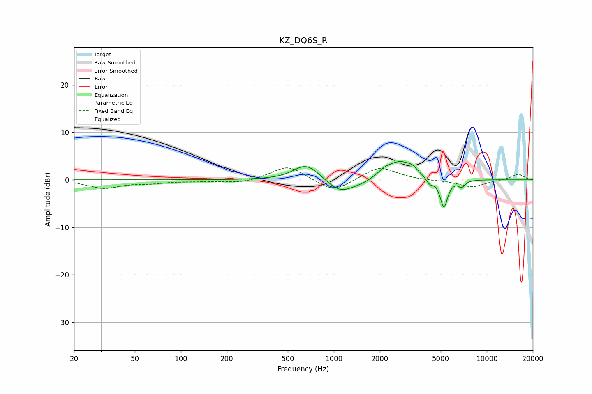

# KZ_DQ6S_R
See [usage instructions](https://github.com/jaakkopasanen/AutoEq#usage) for more options and info.

### Parametric EQs
Apply preamp of -4.0 dB when using parametric equalizer.

|   # | Type    |   Fc (Hz) |    Q |   Gain (dB) |
|-----|---------|-----------|------|-------------|
|   1 | Peaking |       645 | 1.81 |         2.5 |
|   2 | Peaking |       738 | 1.55 |         1.1 |
|   3 | Peaking |      1089 | 1.59 |        -2.9 |
|   4 | Peaking |      1522 | 1.48 |        -0.7 |
|   5 | Peaking |      2132 | 2.98 |         1.1 |
|   6 | Peaking |      2721 | 1.63 |         3.8 |
|   7 | Peaking |      3268 | 4.56 |         0.8 |
|   8 | Peaking |      4236 | 6    |        -1.3 |
|   9 | Peaking |      5243 | 5.6  |        -6   |
|  10 | Peaking |      6859 | 6    |        -1.4 |

### Fixed Band EQs
When using fixed band (also called graphic) equalizer, apply preamp of **-2.6 dB** (if available) and set gains manually with these parameters.

|   # | Type    |   Fc (Hz) |    Q |   Gain (dB) |
|-----|---------|-----------|------|-------------|
|   1 | Peaking |        31 | 1.41 |        -1.7 |
|   2 | Peaking |        62 | 1.41 |        -0.6 |
|   3 | Peaking |       125 | 1.41 |        -0.2 |
|   4 | Peaking |       250 | 1.41 |        -0.7 |
|   5 | Peaking |       500 | 1.41 |         3   |
|   6 | Peaking |      1000 | 1.41 |        -2.7 |
|   7 | Peaking |      2000 | 1.41 |         2.8 |
|   8 | Peaking |      4000 | 1.41 |        -0.1 |
|   9 | Peaking |      8000 | 1.41 |        -1.5 |
|  10 | Peaking |     16000 | 1.41 |         1.2 |

### Graphs

