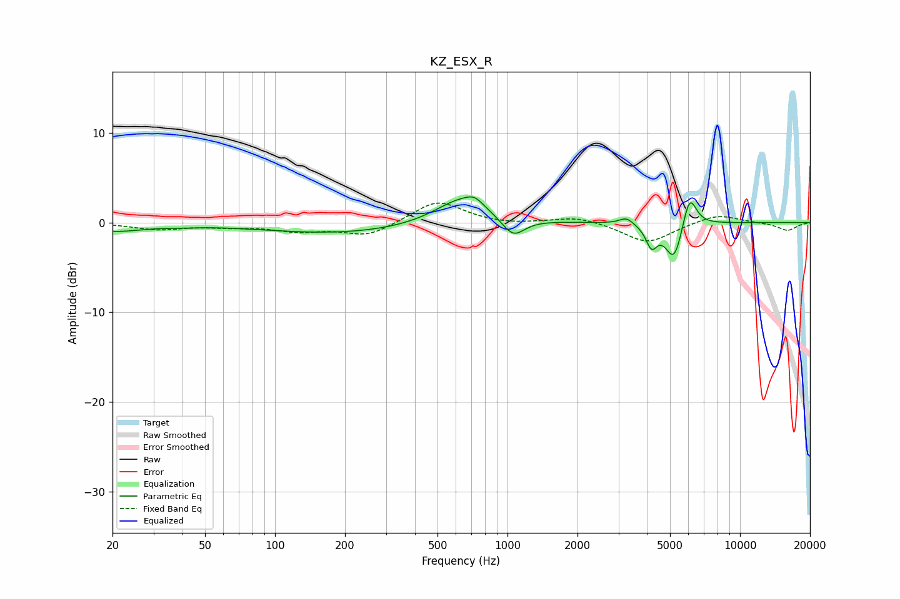

# KZ_ESX_R
See [usage instructions](https://github.com/jaakkopasanen/AutoEq#usage) for more options and info.

### Parametric EQs
Apply preamp of -2.9 dB when using parametric equalizer.

|   # | Type    |   Fc (Hz) |    Q |   Gain (dB) |
|-----|---------|-----------|------|-------------|
|   1 | Peaking |        20 | 1.11 |        -0.9 |
|   2 | Peaking |        39 | 1.85 |        -0.1 |
|   3 | Peaking |       190 | 0.42 |        -1.2 |
|   4 | Peaking |       636 | 1.22 |         3   |
|   5 | Peaking |       722 | 3.96 |         0.8 |
|   6 | Peaking |      1058 | 2.9  |        -2.1 |
|   7 | Peaking |      3249 | 4.8  |         0.8 |
|   8 | Peaking |      4165 | 5.89 |        -2.3 |
|   9 | Peaking |      5207 | 3.77 |        -4.4 |
|  10 | Peaking |      6061 | 4.65 |         3.8 |

### Fixed Band EQs
When using fixed band (also called graphic) equalizer, apply preamp of **-2.3 dB** (if available) and set gains manually with these parameters.

|   # | Type    |   Fc (Hz) |    Q |   Gain (dB) |
|-----|---------|-----------|------|-------------|
|   1 | Peaking |        31 | 1.41 |        -0.7 |
|   2 | Peaking |        62 | 1.41 |        -0.4 |
|   3 | Peaking |       125 | 1.41 |        -0.9 |
|   4 | Peaking |       250 | 1.41 |        -1.5 |
|   5 | Peaking |       500 | 1.41 |         2.5 |
|   6 | Peaking |      1000 | 1.41 |        -0.3 |
|   7 | Peaking |      2000 | 1.41 |         0.7 |
|   8 | Peaking |      4000 | 1.41 |        -2.3 |
|   9 | Peaking |      8000 | 1.41 |         1   |
|  10 | Peaking |     16000 | 1.41 |        -0.9 |

### Graphs

