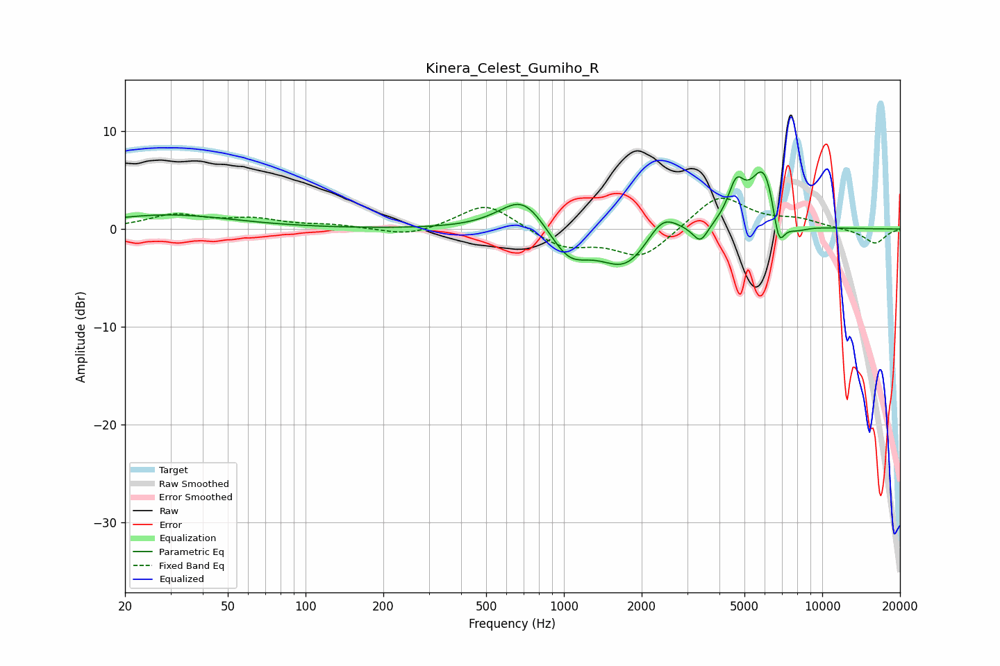

# Kinera_Celest_Gumiho_R
See [usage instructions](https://github.com/jaakkopasanen/AutoEq#usage) for more options and info.

### Parametric EQs
Apply preamp of -5.9 dB when using parametric equalizer.

|   # | Type    |   Fc (Hz) |    Q |   Gain (dB) |
|-----|---------|-----------|------|-------------|
|   1 | Peaking |        29 | 0.56 |         1.4 |
|   2 | Peaking |       695 | 1.55 |         3.7 |
|   3 | Peaking |      1045 | 1.82 |        -3.1 |
|   4 | Peaking |      1739 | 1.41 |        -4   |
|   5 | Peaking |      2407 | 2.3  |         2.6 |
|   6 | Peaking |      3378 | 4.87 |        -1.8 |
|   7 | Peaking |      4645 | 4.49 |         3.5 |
|   8 | Peaking |      5975 | 2.49 |         6.8 |
|   9 | Peaking |      6779 | 5.72 |        -4.2 |
|  10 | Peaking |      7650 | 2.35 |        -1.4 |

### Fixed Band EQs
When using fixed band (also called graphic) equalizer, apply preamp of **-3.3 dB** (if available) and set gains manually with these parameters.

|   # | Type    |   Fc (Hz) |    Q |   Gain (dB) |
|-----|---------|-----------|------|-------------|
|   1 | Peaking |        31 | 1.41 |         1.4 |
|   2 | Peaking |        62 | 1.41 |         0.9 |
|   3 | Peaking |       125 | 1.41 |         0.4 |
|   4 | Peaking |       250 | 1.41 |        -0.8 |
|   5 | Peaking |       500 | 1.41 |         2.7 |
|   6 | Peaking |      1000 | 1.41 |        -1.8 |
|   7 | Peaking |      2000 | 1.41 |        -3   |
|   8 | Peaking |      4000 | 1.41 |         3.6 |
|   9 | Peaking |      8000 | 1.41 |         0.8 |
|  10 | Peaking |     16000 | 1.41 |        -1.5 |

### Graphs

