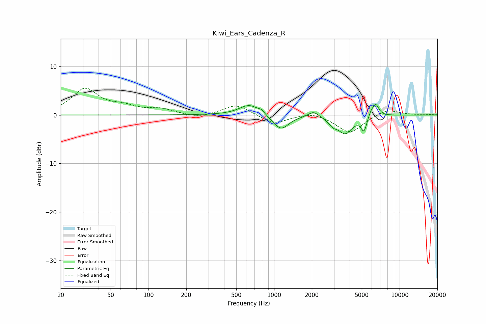

# Kiwi_Ears_Cadenza_R
See [usage instructions](https://github.com/jaakkopasanen/AutoEq#usage) for more options and info.

### Parametric EQs
Apply preamp of -2.2 dB when using parametric equalizer.

|   # | Type    |   Fc (Hz) |    Q |   Gain (dB) |
|-----|---------|-----------|------|-------------|
|   1 | Peaking |       635 | 1.79 |         2.2 |
|   2 | Peaking |       797 | 5.64 |         0.6 |
|   3 | Peaking |      1059 | 1.93 |        -0.6 |
|   4 | Peaking |      1145 | 2.34 |        -2.5 |
|   5 | Peaking |      2063 | 3.57 |         1.2 |
|   6 | Peaking |      2937 | 3.94 |        -1.3 |
|   7 | Peaking |      3696 | 2.48 |        -3.6 |
|   8 | Peaking |      5205 | 6    |        -3   |
|   9 | Peaking |      5911 | 6    |         1   |
|  10 | Peaking |      6457 | 5.38 |         2.4 |

### Fixed Band EQs
When using fixed band (also called graphic) equalizer, apply preamp of **-5.6 dB** (if available) and set gains manually with these parameters.

|   # | Type    |   Fc (Hz) |    Q |   Gain (dB) |
|-----|---------|-----------|------|-------------|
|   1 | Peaking |        31 | 1.41 |         5.2 |
|   2 | Peaking |        62 | 1.41 |         1.4 |
|   3 | Peaking |       125 | 1.41 |         1.1 |
|   4 | Peaking |       250 | 1.41 |        -0.7 |
|   5 | Peaking |       500 | 1.41 |         2.2 |
|   6 | Peaking |      1000 | 1.41 |        -1.9 |
|   7 | Peaking |      2000 | 1.41 |         0.7 |
|   8 | Peaking |      4000 | 1.41 |        -3.7 |
|   9 | Peaking |      8000 | 1.41 |         1.3 |
|  10 | Peaking |     16000 | 1.41 |         0.1 |

### Graphs

