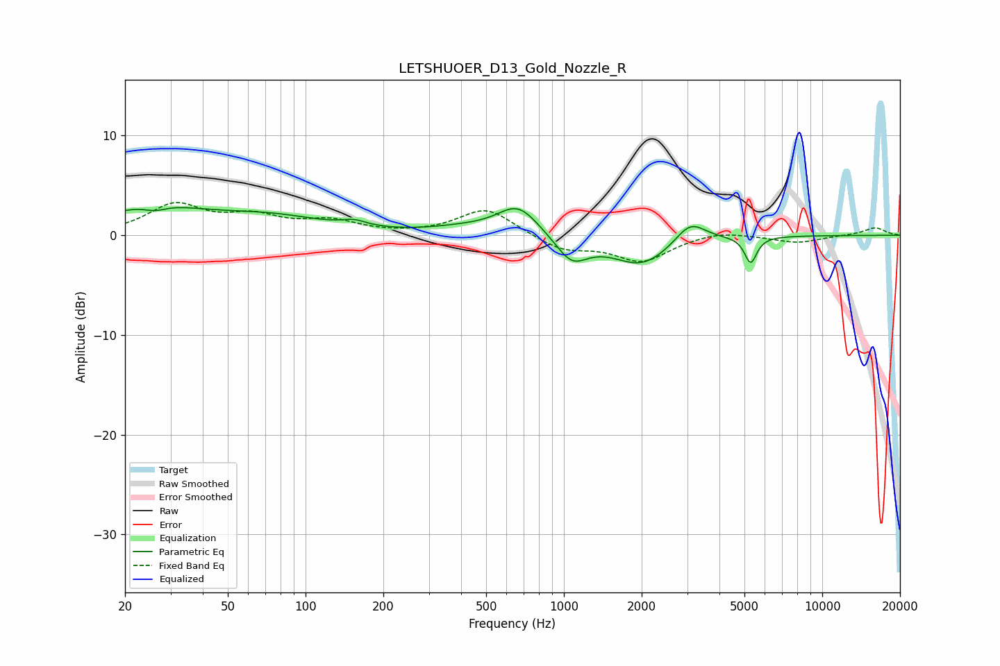

# LETSHUOER_D13_Gold_Nozzle_R
See [usage instructions](https://github.com/jaakkopasanen/AutoEq#usage) for more options and info.

### Parametric EQs
Apply preamp of -2.9 dB when using parametric equalizer.

|   # | Type    |   Fc (Hz) |    Q |   Gain (dB) |
|-----|---------|-----------|------|-------------|
|   1 | Peaking |        25 | 0.74 |         2.6 |
|   2 | Peaking |        26 | 3.22 |        -0.6 |
|   3 | Peaking |        72 | 0.64 |         1.6 |
|   4 | Peaking |       154 | 2.98 |         0.6 |
|   5 | Peaking |       410 | 1.04 |         0.5 |
|   6 | Peaking |       665 | 1.76 |         3   |
|   7 | Peaking |      1072 | 2.29 |        -2.6 |
|   8 | Peaking |      2002 | 1.23 |        -3   |
|   9 | Peaking |      3083 | 2.38 |         2.2 |
|  10 | Peaking |      5284 | 6    |        -2.7 |

### Fixed Band EQs
When using fixed band (also called graphic) equalizer, apply preamp of **-3.4 dB** (if available) and set gains manually with these parameters.

|   # | Type    |   Fc (Hz) |    Q |   Gain (dB) |
|-----|---------|-----------|------|-------------|
|   1 | Peaking |        31 | 1.41 |         2.9 |
|   2 | Peaking |        62 | 1.41 |         1.6 |
|   3 | Peaking |       125 | 1.41 |         1.3 |
|   4 | Peaking |       250 | 1.41 |        -0   |
|   5 | Peaking |       500 | 1.41 |         2.7 |
|   6 | Peaking |      1000 | 1.41 |        -1.5 |
|   7 | Peaking |      2000 | 1.41 |        -2.5 |
|   8 | Peaking |      4000 | 1.41 |         0.5 |
|   9 | Peaking |      8000 | 1.41 |        -0.7 |
|  10 | Peaking |     16000 | 1.41 |         0.8 |

### Graphs

