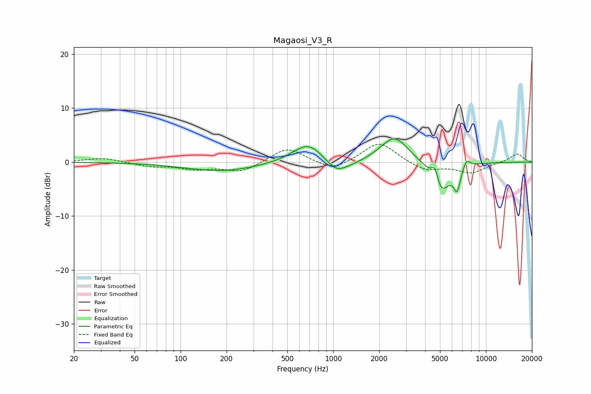

# Magaosi_V3_R
See [usage instructions](https://github.com/jaakkopasanen/AutoEq#usage) for more options and info.

### Parametric EQs
Apply preamp of -4.4 dB when using parametric equalizer.

|   # | Type    |   Fc (Hz) |    Q |   Gain (dB) |
|-----|---------|-----------|------|-------------|
|   1 | Peaking |       186 | 0.59 |        -1.7 |
|   2 | Peaking |       584 | 1.18 |         0.6 |
|   3 | Peaking |       692 | 1.57 |         3.1 |
|   4 | Peaking |      1049 | 2.13 |        -2.3 |
|   5 | Peaking |      1318 | 1.6  |        -0.6 |
|   6 | Peaking |      2517 | 1.57 |         4.8 |
|   7 | Peaking |      4639 | 5.97 |         3.2 |
|   8 | Peaking |      5038 | 2.37 |        -6.3 |
|   9 | Peaking |      6472 | 6    |        -4   |
|  10 | Peaking |      7454 | 5.81 |         1.6 |

### Fixed Band EQs
When using fixed band (also called graphic) equalizer, apply preamp of **-3.4 dB** (if available) and set gains manually with these parameters.

|   # | Type    |   Fc (Hz) |    Q |   Gain (dB) |
|-----|---------|-----------|------|-------------|
|   1 | Peaking |        31 | 1.41 |         0.8 |
|   2 | Peaking |        62 | 1.41 |        -0.7 |
|   3 | Peaking |       125 | 1.41 |        -1.2 |
|   4 | Peaking |       250 | 1.41 |        -1.8 |
|   5 | Peaking |       500 | 1.41 |         2.8 |
|   6 | Peaking |      1000 | 1.41 |        -1.7 |
|   7 | Peaking |      2000 | 1.41 |         3.9 |
|   8 | Peaking |      4000 | 1.41 |        -1.7 |
|   9 | Peaking |      8000 | 1.41 |        -1.9 |
|  10 | Peaking |     16000 | 1.41 |         1.6 |

### Graphs

