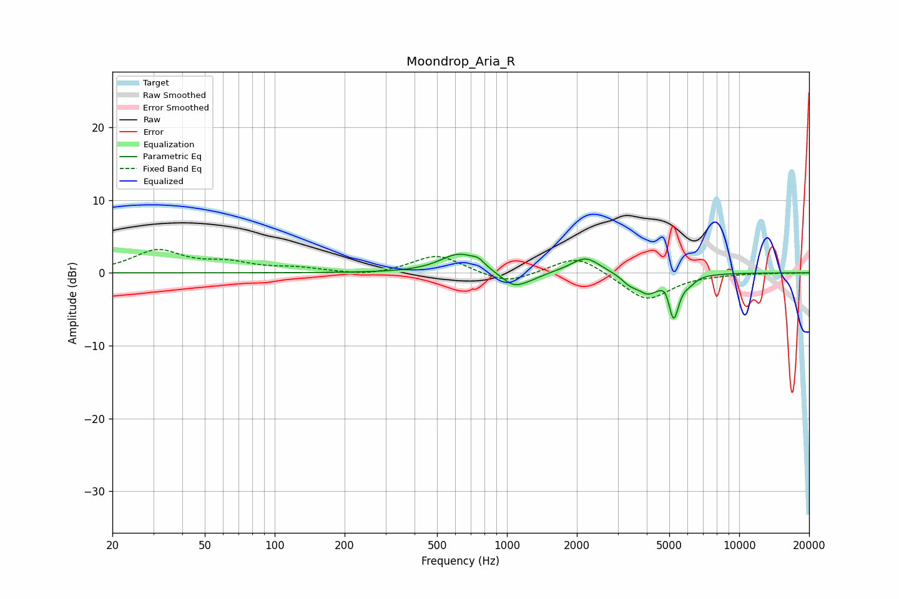

# Moondrop_Aria_R
See [usage instructions](https://github.com/jaakkopasanen/AutoEq#usage) for more options and info.

### Parametric EQs
Apply preamp of -2.7 dB when using parametric equalizer.

|   # | Type    |   Fc (Hz) |    Q |   Gain (dB) |
|-----|---------|-----------|------|-------------|
|   1 | Peaking |       623 | 1.75 |         2.6 |
|   2 | Peaking |       753 | 5.46 |         0.7 |
|   3 | Peaking |      1072 | 2.47 |        -2.1 |
|   4 | Peaking |      1293 | 2.85 |        -0.4 |
|   5 | Peaking |      2180 | 2.26 |         2.2 |
|   6 | Peaking |      3360 | 4.15 |        -1   |
|   7 | Peaking |      4033 | 2.91 |        -2.5 |
|   8 | Peaking |      4862 | 6    |         1.3 |
|   9 | Peaking |      5213 | 5.92 |        -6.2 |
|  10 | Peaking |      6131 | 5.14 |        -0.7 |

### Fixed Band EQs
When using fixed band (also called graphic) equalizer, apply preamp of **-3.3 dB** (if available) and set gains manually with these parameters.

|   # | Type    |   Fc (Hz) |    Q |   Gain (dB) |
|-----|---------|-----------|------|-------------|
|   1 | Peaking |        31 | 1.41 |         3   |
|   2 | Peaking |        62 | 1.41 |         1.2 |
|   3 | Peaking |       125 | 1.41 |         0.6 |
|   4 | Peaking |       250 | 1.41 |        -0.5 |
|   5 | Peaking |       500 | 1.41 |         2.5 |
|   6 | Peaking |      1000 | 1.41 |        -1.6 |
|   7 | Peaking |      2000 | 1.41 |         2.6 |
|   8 | Peaking |      4000 | 1.41 |        -3.8 |
|   9 | Peaking |      8000 | 1.41 |        -0.1 |
|  10 | Peaking |     16000 | 1.41 |        -0   |

### Graphs

