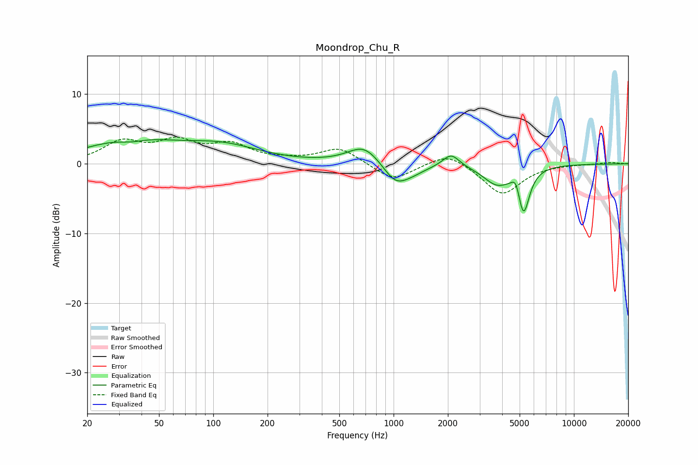

# Moondrop_Chu_R
See [usage instructions](https://github.com/jaakkopasanen/AutoEq#usage) for more options and info.

### Parametric EQs
Apply preamp of -3.6 dB when using parametric equalizer.

|   # | Type    |   Fc (Hz) |    Q |   Gain (dB) |
|-----|---------|-----------|------|-------------|
|   1 | Peaking |        34 | 0.59 |         3.4 |
|   2 | Peaking |        35 | 1.85 |        -0.7 |
|   3 | Peaking |       112 | 0.67 |         2.3 |
|   4 | Peaking |       686 | 1.57 |         2.7 |
|   5 | Peaking |      1021 | 2.05 |        -2.7 |
|   6 | Peaking |      1251 | 1.72 |        -1   |
|   7 | Peaking |      2084 | 3.07 |         1.9 |
|   8 | Peaking |      3735 | 1.86 |        -2.7 |
|   9 | Peaking |      4779 | 6    |         2   |
|  10 | Peaking |      5248 | 4.25 |        -6.7 |

### Fixed Band EQs
When using fixed band (also called graphic) equalizer, apply preamp of **-3.9 dB** (if available) and set gains manually with these parameters.

|   # | Type    |   Fc (Hz) |    Q |   Gain (dB) |
|-----|---------|-----------|------|-------------|
|   1 | Peaking |        31 | 1.41 |         2.9 |
|   2 | Peaking |        62 | 1.41 |         2.8 |
|   3 | Peaking |       125 | 1.41 |         2.5 |
|   4 | Peaking |       250 | 1.41 |         0.3 |
|   5 | Peaking |       500 | 1.41 |         2.3 |
|   6 | Peaking |      1000 | 1.41 |        -2.5 |
|   7 | Peaking |      2000 | 1.41 |         1.8 |
|   8 | Peaking |      4000 | 1.41 |        -4.4 |
|   9 | Peaking |      8000 | 1.41 |        -0   |
|  10 | Peaking |     16000 | 1.41 |         0.2 |

### Graphs

