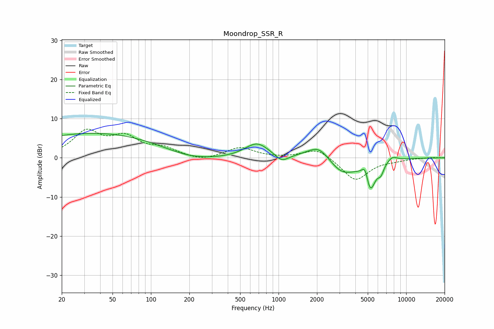

# Moondrop_SSR_R
See [usage instructions](https://github.com/jaakkopasanen/AutoEq#usage) for more options and info.

### Parametric EQs
Apply preamp of -6.3 dB when using parametric equalizer.

|   # | Type    |   Fc (Hz) |    Q |   Gain (dB) |
|-----|---------|-----------|------|-------------|
|   1 | Peaking |        38 | 0.24 |         6.4 |
|   2 | Peaking |       201 | 0.63 |        -2.1 |
|   3 | Peaking |       678 | 1.49 |         3.8 |
|   4 | Peaking |      1059 | 2.73 |        -2   |
|   5 | Peaking |      2079 | 1.5  |         4.1 |
|   6 | Peaking |      3127 | 1.22 |        -4.6 |
|   7 | Peaking |      4767 | 5.71 |         3.4 |
|   8 | Peaking |      5228 | 3.45 |        -7.7 |
|   9 | Peaking |      6333 | 5.97 |        -2.2 |
|  10 | Peaking |      7796 | 3.56 |         1.3 |

### Fixed Band EQs
When using fixed band (also called graphic) equalizer, apply preamp of **-7.4 dB** (if available) and set gains manually with these parameters.

|   # | Type    |   Fc (Hz) |    Q |   Gain (dB) |
|-----|---------|-----------|------|-------------|
|   1 | Peaking |        31 | 1.41 |         6.4 |
|   2 | Peaking |        62 | 1.41 |         4.6 |
|   3 | Peaking |       125 | 1.41 |         2.1 |
|   4 | Peaking |       250 | 1.41 |        -1   |
|   5 | Peaking |       500 | 1.41 |         2.6 |
|   6 | Peaking |      1000 | 1.41 |        -0.1 |
|   7 | Peaking |      2000 | 1.41 |         2.6 |
|   8 | Peaking |      4000 | 1.41 |        -5.9 |
|   9 | Peaking |      8000 | 1.41 |        -0.5 |
|  10 | Peaking |     16000 | 1.41 |         0.1 |

### Graphs

