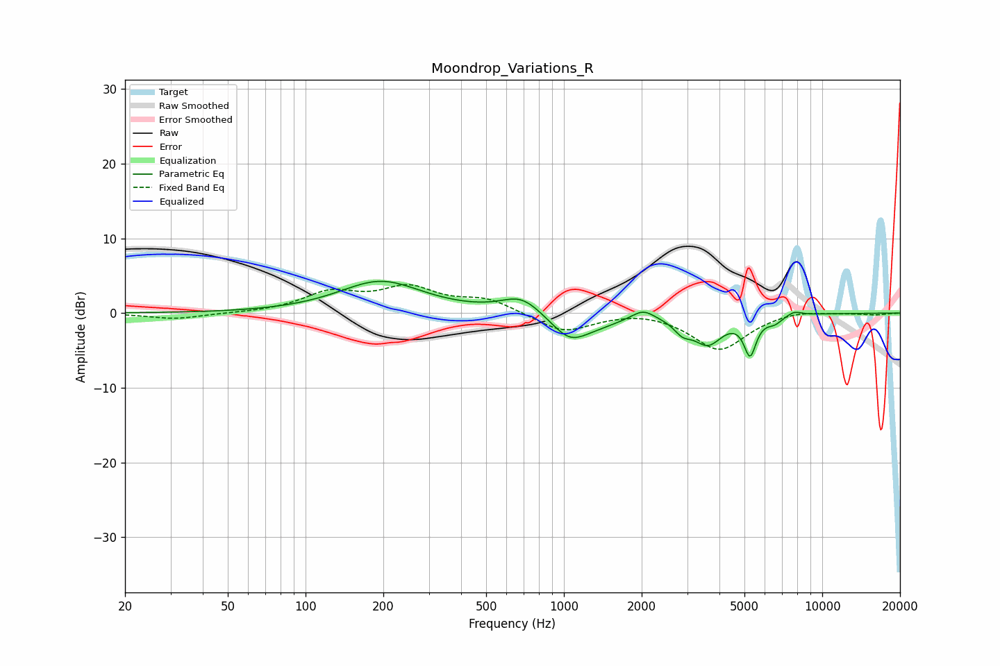

# Moondrop_Variations_R
See [usage instructions](https://github.com/jaakkopasanen/AutoEq#usage) for more options and info.

### Parametric EQs
Apply preamp of -4.4 dB when using parametric equalizer.

|   # | Type    |   Fc (Hz) |    Q |   Gain (dB) |
|-----|---------|-----------|------|-------------|
|   1 | Peaking |       195 | 0.89 |         4.2 |
|   2 | Peaking |       686 | 1.82 |         2.3 |
|   3 | Peaking |      1056 | 1.87 |        -3.6 |
|   4 | Peaking |      1407 | 1.72 |        -0.8 |
|   5 | Peaking |      2025 | 3.38 |         1.3 |
|   6 | Peaking |      2881 | 4.15 |        -1.6 |
|   7 | Peaking |      3607 | 2.49 |        -3.8 |
|   8 | Peaking |      5256 | 5.93 |        -4.9 |
|   9 | Peaking |      6548 | 4.42 |        -0.9 |
|  10 | Peaking |      7775 | 4.54 |         0.6 |

### Fixed Band EQs
When using fixed band (also called graphic) equalizer, apply preamp of **-3.9 dB** (if available) and set gains manually with these parameters.

|   # | Type    |   Fc (Hz) |    Q |   Gain (dB) |
|-----|---------|-----------|------|-------------|
|   1 | Peaking |        31 | 1.41 |        -0.8 |
|   2 | Peaking |        62 | 1.41 |        -0   |
|   3 | Peaking |       125 | 1.41 |         2.6 |
|   4 | Peaking |       250 | 1.41 |         3.1 |
|   5 | Peaking |       500 | 1.41 |         1.8 |
|   6 | Peaking |      1000 | 1.41 |        -2.6 |
|   7 | Peaking |      2000 | 1.41 |         0.5 |
|   8 | Peaking |      4000 | 1.41 |        -4.9 |
|   9 | Peaking |      8000 | 1.41 |         0.5 |
|  10 | Peaking |     16000 | 1.41 |        -0.2 |

### Graphs

