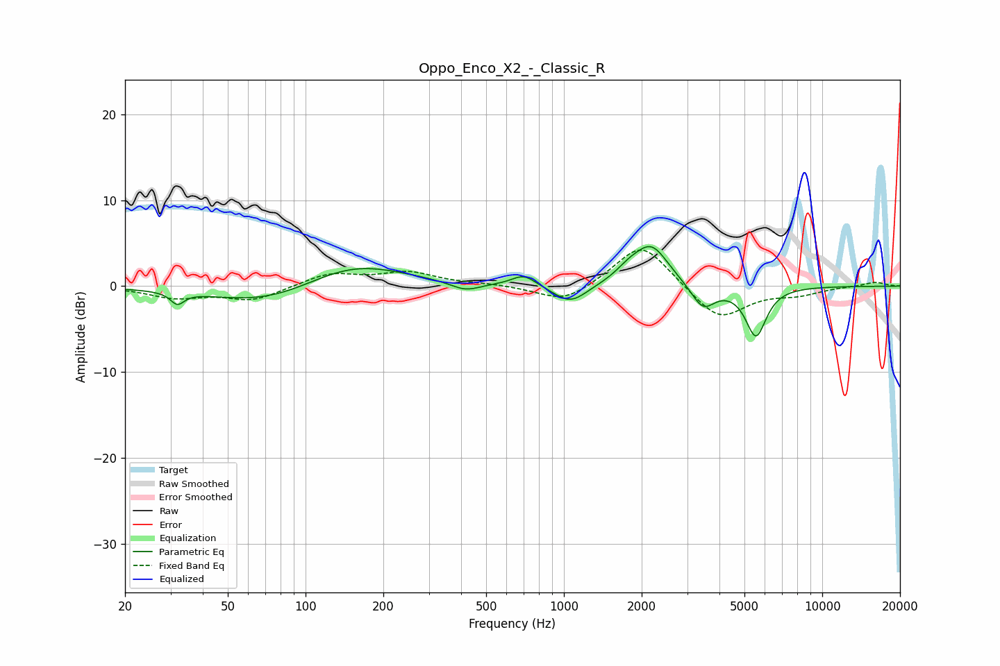

# Oppo_Enco_X2_-_Classic_R
See [usage instructions](https://github.com/jaakkopasanen/AutoEq#usage) for more options and info.

### Parametric EQs
Apply preamp of -4.7 dB when using parametric equalizer.

|   # | Type    |   Fc (Hz) |    Q |   Gain (dB) |
|-----|---------|-----------|------|-------------|
|   1 | Peaking |        32 | 5.52 |        -1.4 |
|   2 | Peaking |        73 | 0.64 |        -2.4 |
|   3 | Peaking |       151 | 0.7  |         3.2 |
|   4 | Peaking |       415 | 2.4  |        -1   |
|   5 | Peaking |       700 | 3    |         1.3 |
|   6 | Peaking |      1059 | 2.16 |        -2.2 |
|   7 | Peaking |      1780 | 2.78 |         1.1 |
|   8 | Peaking |      2182 | 2.08 |         4.6 |
|   9 | Peaking |      3454 | 3.08 |        -2.8 |
|  10 | Peaking |      5539 | 3.47 |        -5.8 |

### Fixed Band EQs
When using fixed band (also called graphic) equalizer, apply preamp of **-4.3 dB** (if available) and set gains manually with these parameters.

|   # | Type    |   Fc (Hz) |    Q |   Gain (dB) |
|-----|---------|-----------|------|-------------|
|   1 | Peaking |        31 | 1.41 |        -1.2 |
|   2 | Peaking |        62 | 1.41 |        -1.6 |
|   3 | Peaking |       125 | 1.41 |         1.5 |
|   4 | Peaking |       250 | 1.41 |         1.5 |
|   5 | Peaking |       500 | 1.41 |         0.2 |
|   6 | Peaking |      1000 | 1.41 |        -2.1 |
|   7 | Peaking |      2000 | 1.41 |         5.3 |
|   8 | Peaking |      4000 | 1.41 |        -4   |
|   9 | Peaking |      8000 | 1.41 |        -0.8 |
|  10 | Peaking |     16000 | 1.41 |         0.5 |

### Graphs

