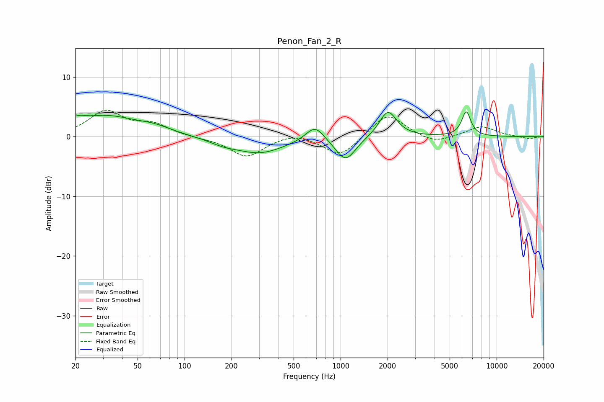

# Penon_Fan_2_R
See [usage instructions](https://github.com/jaakkopasanen/AutoEq#usage) for more options and info.

### Parametric EQs
Apply preamp of -4.3 dB when using parametric equalizer.

|   # | Type    |   Fc (Hz) |    Q |   Gain (dB) |
|-----|---------|-----------|------|-------------|
|   1 | Peaking |        20 | 4.5  |         3.6 |
|   2 | Peaking |        20 | 5.98 |        -2.4 |
|   3 | Peaking |        31 | 0.68 |         3.3 |
|   4 | Peaking |        64 | 1.32 |         0.9 |
|   5 | Peaking |       177 | 1.62 |        -0.7 |
|   6 | Peaking |       303 | 0.87 |        -2.7 |
|   7 | Peaking |       685 | 2.41 |         2.7 |
|   8 | Peaking |      1077 | 2.18 |        -4   |
|   9 | Peaking |      2011 | 2.54 |         4.5 |
|  10 | Peaking |      6388 | 4.72 |         4.1 |

### Fixed Band EQs
When using fixed band (also called graphic) equalizer, apply preamp of **-4.5 dB** (if available) and set gains manually with these parameters.

|   # | Type    |   Fc (Hz) |    Q |   Gain (dB) |
|-----|---------|-----------|------|-------------|
|   1 | Peaking |        31 | 1.41 |         4.1 |
|   2 | Peaking |        62 | 1.41 |         1.9 |
|   3 | Peaking |       125 | 1.41 |        -0.2 |
|   4 | Peaking |       250 | 1.41 |        -3.4 |
|   5 | Peaking |       500 | 1.41 |         0.9 |
|   6 | Peaking |      1000 | 1.41 |        -3.4 |
|   7 | Peaking |      2000 | 1.41 |         4.1 |
|   8 | Peaking |      4000 | 1.41 |        -1.3 |
|   9 | Peaking |      8000 | 1.41 |         1.7 |
|  10 | Peaking |     16000 | 1.41 |        -0.4 |

### Graphs

