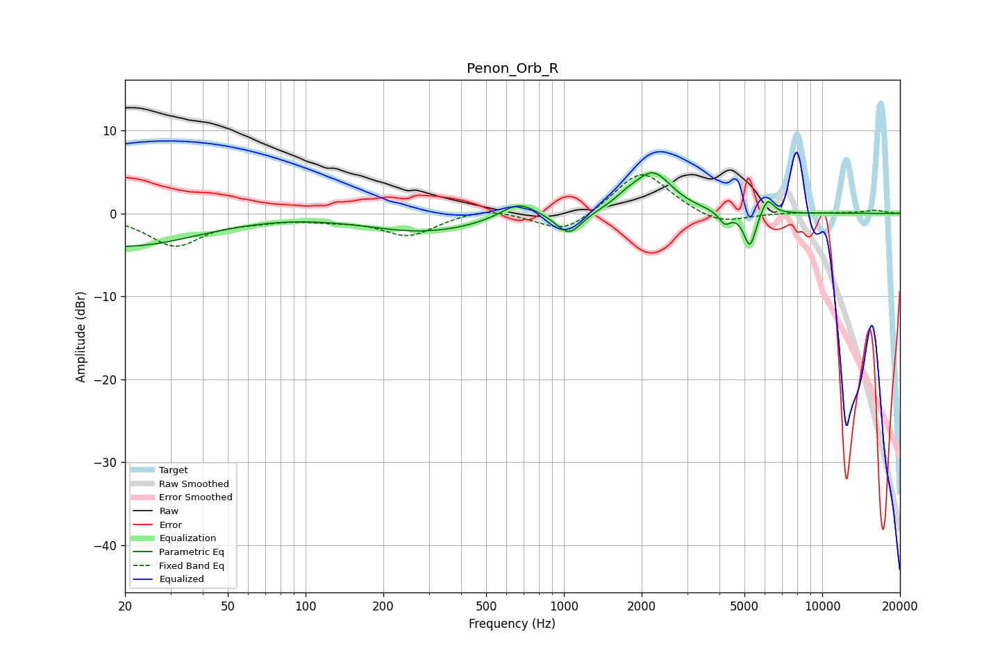

# Penon_Orb_R
See [usage instructions](https://github.com/jaakkopasanen/AutoEq#usage) for more options and info.

### Parametric EQs
Apply preamp of -5.0 dB when using parametric equalizer.

|   # | Type    |   Fc (Hz) |    Q |   Gain (dB) |
|-----|---------|-----------|------|-------------|
|   1 | Peaking |        20 | 0.48 |        -4   |
|   2 | Peaking |       170 | 0.22 |         0.4 |
|   3 | Peaking |       289 | 0.58 |        -2.5 |
|   4 | Peaking |       667 | 2.04 |         2   |
|   5 | Peaking |      1046 | 2.86 |        -2.7 |
|   6 | Peaking |      1743 | 2.92 |         0.8 |
|   7 | Peaking |      2213 | 1.92 |         4.8 |
|   8 | Peaking |      4196 | 6    |        -1.5 |
|   9 | Peaking |      5246 | 6    |        -4.3 |
|  10 | Peaking |      6133 | 5.87 |         2   |

### Fixed Band EQs
When using fixed band (also called graphic) equalizer, apply preamp of **-4.7 dB** (if available) and set gains manually with these parameters.

|   # | Type    |   Fc (Hz) |    Q |   Gain (dB) |
|-----|---------|-----------|------|-------------|
|   1 | Peaking |        31 | 1.41 |        -3.8 |
|   2 | Peaking |        62 | 1.41 |        -0.6 |
|   3 | Peaking |       125 | 1.41 |        -0.6 |
|   4 | Peaking |       250 | 1.41 |        -2.6 |
|   5 | Peaking |       500 | 1.41 |         0.9 |
|   6 | Peaking |      1000 | 1.41 |        -2.5 |
|   7 | Peaking |      2000 | 1.41 |         5.3 |
|   8 | Peaking |      4000 | 1.41 |        -1.5 |
|   9 | Peaking |      8000 | 1.41 |         0.1 |
|  10 | Peaking |     16000 | 1.41 |         0.4 |

### Graphs

