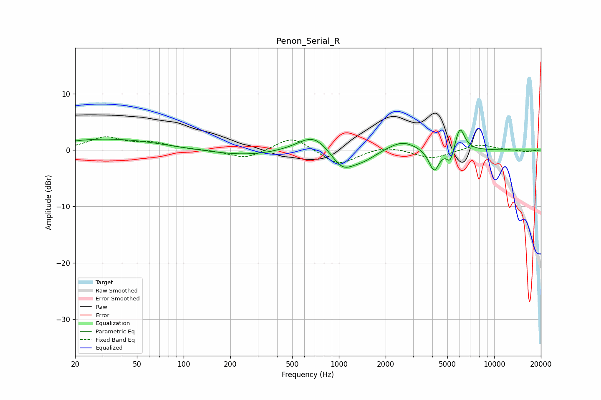

# Penon_Serial_R
See [usage instructions](https://github.com/jaakkopasanen/AutoEq#usage) for more options and info.

### Parametric EQs
Apply preamp of -3.6 dB when using parametric equalizer.

|   # | Type    |   Fc (Hz) |    Q |   Gain (dB) |
|-----|---------|-----------|------|-------------|
|   1 | Peaking |        25 | 0.63 |         1.3 |
|   2 | Peaking |        51 | 0.61 |         1   |
|   3 | Peaking |       252 | 0.65 |        -1   |
|   4 | Peaking |       690 | 1.38 |         3.2 |
|   5 | Peaking |      1053 | 1.86 |        -3.5 |
|   6 | Peaking |      1437 | 1.69 |        -1.4 |
|   7 | Peaking |      2565 | 1.53 |         1.8 |
|   8 | Peaking |      4103 | 4.18 |        -4   |
|   9 | Peaking |      5225 | 6    |        -2.6 |
|  10 | Peaking |      6015 | 4.47 |         4.3 |

### Fixed Band EQs
When using fixed band (also called graphic) equalizer, apply preamp of **-2.5 dB** (if available) and set gains manually with these parameters.

|   # | Type    |   Fc (Hz) |    Q |   Gain (dB) |
|-----|---------|-----------|------|-------------|
|   1 | Peaking |        31 | 1.41 |         2.2 |
|   2 | Peaking |        62 | 1.41 |         1.1 |
|   3 | Peaking |       125 | 1.41 |         0.1 |
|   4 | Peaking |       250 | 1.41 |        -1.6 |
|   5 | Peaking |       500 | 1.41 |         2.5 |
|   6 | Peaking |      1000 | 1.41 |        -2.7 |
|   7 | Peaking |      2000 | 1.41 |         0.8 |
|   8 | Peaking |      4000 | 1.41 |        -1.5 |
|   9 | Peaking |      8000 | 1.41 |         1.1 |
|  10 | Peaking |     16000 | 1.41 |        -0.3 |

### Graphs

